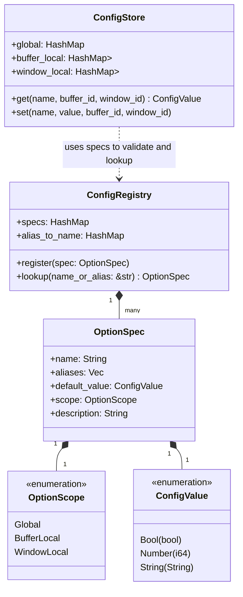

# Option and Configurations System Design

This document describes the design and integration plan for a flexible, hierarchical configurations system for NextVim.

## 1. Requirements

- **Type Safety**: Support boolean, integer, and string options.
- **Hierarchical Scopes**: Options can be scoped to `Global`, `Buffer` (buffer-local), or `Window` (window-local). Resolving an option value should fallback from specific scopes to the global value.
- **Abbreviation & Aliasing**: Support standard Vim-style long names and short aliases (e.g., `tabstop` / `ts`, `number` / `nu`).
- **Script and CLI Integration**: Easy parsing of command-line arguments (e.g., `--cmd "set ts=4"`) and command execution within script files (e.g., `:set number`).
- **Validation and Hooks**: Ability to trigger actions or validate values when option changes (e.g., reloading colorscheme or triggering UI redraws).

---

## 2. Architecture & Design

### Option Resolution Fallback Path
When querying an option value (e.g. `number` or `tabstop`) in a given context (current buffer `B` and window `W`):
1. Check `OptionScope` of the option from the `ConfigRegistry`.
2. If `WindowLocal`, look up in `window_local[W]`. If not found, look up in `global`.
3. If `BufferLocal`, look up in `buffer_local[B]`. If not found, look up in `global`.
4. If `Global`, look up in `global`.
5. If still not found, return the option's default value defined in its `OptionSpec`.

---

## 3. Configuration Module (`@src/app/config`)

We will create a new directory at `src/app/config` containing:
- [mod.rs](file:///home/iceman/Developer/rust/nextvim/nxvim/src/app/config/mod.rs): The main module declaration and public APIs.
- [registry.rs](file:///home/iceman/Developer/rust/nextvim/nxvim/src/app/config/registry.rs): Define specs and load standard editor options (e.g. `number`, `tabstop`, `shiftwidth`, `expandtab`).
- [store.rs](file:///home/iceman/Developer/rust/nextvim/nxvim/src/app/config/store.rs): Context-aware value store (global, buffer-local, window-local maps).

---

## 4. Integration Plan

### CLI Integration (`src/app/args.rs` & `src/app/mod.rs`)
- Allow pre-config command parsing of option setters.
- Store `ConfigStore` in `App` struct.

### Script Integration (`src/script/commands.rs` & `src/script/registry.rs`)
- Define the `set` command in `COMMAND_SPECS`.
- Implement `set` execution in `src/script/commands.rs` to parse strings like `ts=4`, `number`, `nonumber`, `nu`, and execute option modifications against the app state.
