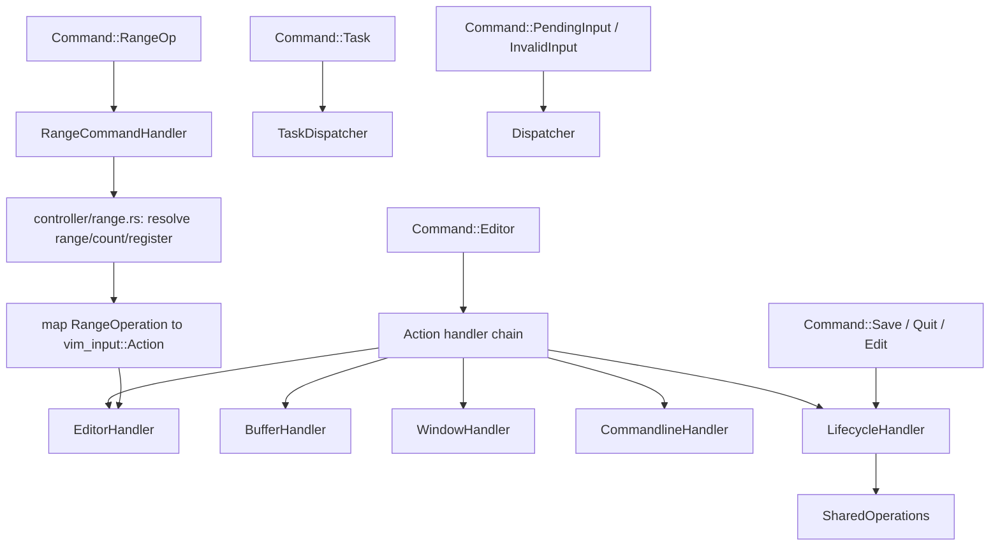

# Controller/Dispatcher Cleanup Plan

This document inventories the current mess in `src/controller` (plus the
`src/script` boundary that feeds it) and lays out a phased, buildable plan to
fix it. It complements `SCRIPT.md` (Ex-command roadmap); read that first if
you need the wider context on which Ex commands are prioritized next. This
document is authoritative for controller/dispatcher internals.

## Why this matters now

`SCRIPT.md` P1.2/P1.3 are about to add nine more range-taking Ex commands
(`yank`, `put`, `copy`/`move`, `join`, `<`/`>`/`=`, `change`, `append`/`insert`,
`retab`/`sort`/`uniq`, then `substitute`/`global`), and P1.1/P0.4 call for
`wq`, `wqall`, `read`, `file` to stop being `NOTIMPL` stubs. Every one of these
will be implemented by copying the shape that `Command::Delete` and
`Command::Quit`/`Command::Edit` already use in `src/controller/dispatcher.rs`.
If that shape isn't cleaned up first, the dispatcher will grow by ~60
duplicated lines per new ranged command. This plan exists to fix the shape
*before* that growth happens, per `SCRIPT.md` P0.3 ("shared editor operation
API... both `vim-input::Action` and Ex handlers should call these
operations").

## Inventory of the current mess

1. **Two independent quit paths.** `Command::Quit { force }` (produced by
   script `:quit`/`:qall`/`:cquit`) is a top-level match arm in
   `Dispatcher::dispatch`. Separately, the `Command::Editor` arm special-cases
   `action == Action::Quit` *inline*, before running `EditorHandler`, with its
   own copy of the same `SharedOperations::quit` call and the same
   `Ok`/`Err`-to-status translation. Two call sites, one behavior, no shared
   code.

2. **Two incompatible handler shapes coexist.** `BufferHandler`,
   `WindowHandler`, and `CommandlineHandler` share a `handles(&Action) -> bool`
   + `execute(...)` shape and are chained uniformly inside the `Command::Editor`
   arm. `SaveHandler`, and the bodies of `Command::Save`/`Command::Quit`/
   `Command::Edit`/`Command::Delete`, are instead hand-written directly inside
   `Dispatcher::dispatch`'s top-level match, with no shared shape at all.
   Anyone adding a new command has to guess which style to copy.

3. **`SaveHandler` is a dead wrapper.** `src/controller/save_handler.rs` is
   three lines that forward to `SharedOperations::write` and add nothing (no
   `handles()`, no extra state, no extra logic). It exists only for symmetry
   with the other `*_handler.rs` files, but that symmetry is false — it
   doesn't share their shape (no `handles()`) and isn't called the way they
   are (it's a top-level match arm, not part of the `Command::Editor` chain).

4. **`Command::Delete` inlines an entire ad hoc pipeline directly in
   `Dispatcher::dispatch`** (~60 lines): it defines an
   `EditorRangeStateProvider` struct in `dispatcher.rs` itself, resolves the
   range via `vim_script::host::resolve_range`, synthesizes a
   `vim_input::Action::DeleteLines`, re-derives the exact status-message format
   already duplicated in the `Command::Editor` arm, and then re-implements the
   `EditorHandler` + `BufferHandler` merge tail almost verbatim. This is the
   general shape every future ranged Ex command (`yank`, `copy`, `move`,
   `join`, `substitute`, `global`, ...) will need — but today there is no
   reusable version of it, only one inlined copy for `delete`.

5. **Repeated `Result` → status-message boilerplate.** `Command::Quit` and
   `Command::Edit` both do:
   ```rust
   match SharedOperations::x(...) {
       Ok(outcome) => outcome,
       Err(error) => { app.model.status = Some(error.message); CommandOutcome::redraw() }
   }
   ```
   `wq`, `wqall`, `read`, and `file` (currently `NOTIMPL` stubs in
   `src/script/commands.rs`) will need the identical translation the moment
   they're implemented.

6. **The `Command` enum mixes "ready to apply" and "needs live state to
   resolve" payloads with no naming or structural distinction.** `Editor`
   carries a fully resolved `vim_input::Action`. `Delete` carries an
   *unresolved* `vim_script::ast::CommandRange` that only becomes an `Action`
   once `Dispatcher` runs it against live cursor/mark state. Nothing in the
   type signals this difference, so it's easy to keep bolting resolved and
   unresolved variants onto the same flat enum, as happened with `Delete`.

7. **Adding one new Ex command already touches 4+ files with no enforced
   symmetry:** `src/script/registry.rs` (spec), `src/script/commands.rs`
   (`CommandRequest` → `Command` mapping), `src/controller/command.rs`
   (possibly a new `Command` variant), `src/controller/dispatcher.rs` (a new
   top-level match arm, possibly a new handler file). There is no single seam
   that guarantees a minimal, consistent diff for a new command.

None of this is a correctness bug today — the existing tests in
`src/controller/mod.rs`, `src/controller/task_dispatcher.rs`, and
`src/script.rs` pass. It's a maintenance and consistency problem that is about
to get much worse as `SCRIPT.md` P1.2/P1.3 land.

## Target shape



Two structural changes drive everything else:

- **One handler shape.** Every handler — existing (`Editor`, `Buffer`,
  `Window`, `Commandline`) and new (`Lifecycle`, `Range`) — is a small struct
  with `handles`/`execute` or an equivalent explicit entry point, called from
  `Dispatcher::dispatch` with no inline business logic left in the match
  itself. `Dispatcher::dispatch` becomes a pure router: each arm is one call
  into a handler module.
- **One reusable range-resolution seam.** `controller/range.rs` owns
  `EditorRangeStateProvider` and a function that turns
  `(CommandRange, count, register)` plus a `RangeOperation` into a resolved
  `vim_input::Action`, so `delete` today and `yank`/`put`/`copy`/`move`/`join`/
  `substitute`/`global` tomorrow share one implementation instead of one
  inlined copy each.

Script commands keep working exactly as `STRUCTURE.md` Phase 2/3 established:
`src/script/commands.rs` is the only place that maps a resolved
`vim_script::host::CommandRequest` to a `controller::Command`, and it must keep
emitting *unresolved* payloads (ranges, counts, registers) for anything that
depends on live cursor/mark/window state, because the script adapter runs
off an `mpsc` channel with no access to `Ui`/`EditorModel`. That design is
correct and unchanged by this plan — what changes is that the dispatcher side
of the seam stops being reinvented per command.

## Phase 1 — Remove dead indirection, unify the two quit paths — completed

1. Delete `src/controller/save_handler.rs`. Change the `Command::Save` arm in
   `Dispatcher::dispatch` to call `SharedOperations::write` directly (it
   already takes the same arguments `SaveHandler::execute` forwarded).
2. Add a small shared helper for the repeated `Result<CommandOutcome, _> ->
   CommandOutcome` translation used by `Command::Quit` and `Command::Edit`
   today (e.g. `fn outcome_or_status(app, result) -> CommandOutcome` in
   `dispatcher.rs`, or a method on `CommandOutcome`). Use it from both arms.
3. Add `src/controller/lifecycle_handler.rs` with the same `handles`/`execute`
   shape as `BufferHandler`/`WindowHandler`/`CommandlineHandler`, initially
   covering only `Action::Quit`. Its `execute` calls
   `SharedOperations::quit(..., force: false)` through the same helper from
   step 2.
4. Remove the inline `Action::Quit` special case from the `Command::Editor`
   arm; add `LifecycleHandler` to the same handler chain as
   `BufferHandler`/`WindowHandler`/`CommandlineHandler` in that arm.
5. Move the `Command::Quit` and `Command::Edit` top-level match arm bodies into
   plain functions on `LifecycleHandler` (called directly from
   `Dispatcher::dispatch`, since they're driven by a `Command` variant, not an
   `Action`) so quit/save/edit behavior lives in one file instead of split
   across `dispatcher.rs` inline code, `save_handler.rs`, and
   `shared_operations.rs`.

Build-and-run checkpoint:

```sh
cargo test -p vim-input
cargo test
scripts/check-architecture.sh
```

Terminal smoke test: `:quit`, `:quit!` on a modified buffer, keyboard quit
(`ZZ`/mapped `Action::Quit` key), `:write`, `:edit somefile`.

Completion criteria:

- `save_handler.rs` no longer exists; no references remain.
- `Action::Quit` and `Command::Quit` both resolve through
  `LifecycleHandler`/`SharedOperations::quit`; there is exactly one call site
  for that operation.
- `Dispatcher::dispatch`'s `Command::Editor` arm has no inline `match action`
  special case before the handler chain.

## Phase 2 — Extract a reusable range-command seam — completed

1. Create `src/controller/range.rs`. Move `EditorRangeStateProvider` (and its
   `RangeStateProvider` impl) out of `dispatcher.rs` into this new module,
   unchanged in behavior.
2. Define `RangeOperation` (start with a single variant, `Delete`) and change
   `Command::Delete { range, count, register }` to
   `Command::RangeOp { operation: RangeOperation, range, count, register }`.
   Update the `delete()` mapping in `src/script/commands.rs` accordingly, and
   update the `Command::Delete` tests in `src/script.rs` and
   `src/controller/mod.rs` to match the renamed/reshaped variant.
3. Add `RangeCommandHandler` (in `range.rs` or a sibling
   `range_command_handler.rs`) with one `execute` function that: builds the
   `EditorRangeStateProvider`, resolves `(range, count)` to concrete line
   bounds via `vim_script::host::resolve_range` (falling back to the current
   cursor line when there's no range, exactly as today), maps
   `RangeOperation` to a `vim_input::Action` (one match arm per operation —
   just `Delete => Action::DeleteLines { start_line, end_line }` for now),
   applies the shared status-message helper from Phase 3, and runs the result
   through `EditorHandler` (+ `BufferHandler` when relevant), exactly as the
   current inline block does.
4. Replace the ~60-line inline block in `Dispatcher::dispatch` with:
   `Command::RangeOp { operation, range, count, register } =>
   RangeCommandHandler::execute(app, operation, range, count, register)`.

Build-and-run checkpoint:

```sh
cargo test -p vim-script
cargo test
scripts/check-architecture.sh
```

Terminal smoke test: `:1,2d`, `:1,2d a`, `:d` with no range (current line),
`:d 3` (count).

Completion criteria:

- `dispatcher.rs` contains no struct/trait-impl definitions and no range
  resolution logic; it is a pure router.
- Adding `RangeOperation::Yank` (a later phase, tracked in `SCRIPT.md` P1.2)
  requires touching only `range.rs` (one match arm) and
  `src/script/commands.rs` (one mapping function) — no dispatcher or `Command`
  enum changes beyond the already-generic `RangeOp` variant.

## Phase 3 — Unify status-message construction — completed

1. Extract the repeated
   `format!("[{:?}] Action: {:?}", mode, action)` (+ `" (reg: '{register}')"`
   suffix when present) into one helper — for example
   `fn describe_action(mode: vim_input::Mode, action: &vim_input::Action,
   register: Option<char>) -> String` in `dispatcher.rs` or `command.rs`.
2. Use it from the `Command::Editor` arm and from `RangeCommandHandler`
   (Phase 2), which currently duplicate this exact formatting.

Build-and-run checkpoint: `cargo test`, plus a terminal smoke test confirming
the status line still shows `[Mode] Action: ...` for both a normal keystroke
and a `:delete` range command.

Completion criteria: the format string exists in exactly one place.

## Phase 4 — Apply the seams to the next Ex commands — completed

1. Implemented `:yank` and `:put` (`SCRIPT.md` P1.2) as
   `RangeOperation::Yank` / `RangeOperation::Put`. Each is one match arm in
   `range.rs`'s `resolve_action` and one mapping function in
   `src/script/commands.rs`. No new dispatcher arm, no new handler file.
   `:put` needed a real seam gap fix (below).
2. Implemented `wq`/`wqall` (`SCRIPT.md` P1.1, previously `NOTIMPL` in
   `src/script/commands.rs`) as `LifecycleHandler::write_and_quit` /
   `write_and_quit_all`, composing `SharedOperations::write_result` and
   `LifecycleHandler::quit`. `write_and_quit_all` documents, rather than
   fixes, the pre-existing `:qall` simplification (`SharedOperations::quit`
   does not yet distinguish closing one window from closing all windows —
   still tracked by `SCRIPT.md` P0.4).
3. Seam gaps found and fixed, per the original plan's instruction to extend
   the seam rather than special-case `dispatcher.rs`:
   - `:put` addresses a single line and has no existing keyboard-driven
     `vim_input::Action` equivalent (`Action::Put`/`PutBefore` paste at the
     *current cursor position*, not an arbitrary addressed line). Added
     `vim_input::Action::PutLines { line, before }`, implemented in
     `src/controller/editor.rs` by positioning the selection and reusing the
     existing `paste` helper (with a direct-prepend special case for
     `:0put!`/putting before line 1). This mirrors how `DeleteLines`/
     `YankLines` already exist as range-only actions with no keyboard
     binding.
   - `Command::RangeOp` gained a `bang: bool` field so `:put!` (put before
     instead of after) can flow through the same seam as every other ranged
     command; `Delete`/`Yank` ignore it today.
   - `wq`/`wqall` needed to know whether the write actually succeeded before
     quitting. `SharedOperations::write` folds errors into the status message
     and always returns `CommandOutcome`, which cannot express that. Added
     `SharedOperations::write_result -> Result<CommandOutcome, BufferError>`;
     `write` is now a thin wrapper over it, and `write_and_quit` is the
     second caller. (An earlier version of this change tried to infer
     success from the buffer's modified flag instead of adding
     `write_result`; a dispatcher-level test — buffers that were never
     edited and have no file name — caught that it quit even though the
     write failed with `NoFileName`. That test
     (`write_quit_does_not_quit_when_the_write_fails`) stays in
     `controller/mod.rs` as a regression guard.)
4. Added dispatcher-level tests exercising each new command end-to-end
     through `Dispatcher::dispatch` (not just that the script layer emits the
     right `Command`): `range_op_yank_copies_lines_without_modifying_the_buffer`,
     `range_op_put_inserts_the_yanked_text_after_the_addressed_line`,
     `write_quit_saves_the_buffer_and_quits_when_it_is_the_last_window`,
     `write_quit_all_saves_the_buffer_and_quits_when_it_is_the_last_window`,
     `write_quit_does_not_quit_when_the_write_fails`.

Note on the original completion criteria: this phase does add two new thin
`Command` variants (`WriteQuit`, `WriteQuitAll`), each with a one-line
dispatcher arm delegating to `LifecycleHandler` — the same shape `Save`/
`Quit`/`Edit` already use. The "no new `Command` variant" bar was about not
repeating the *inlined pipeline* mistake for new **ranged** commands (which
`RangeOp` fully avoided for `yank`/`put`); it was never meant to forbid the
established thin-variant-plus-handler shape for new **lifecycle** commands.

Build-and-run checkpoint (all passing):

```sh
cargo build --workspace
cargo test        # 41/41 in the nxvim binary crate
scripts/check-architecture.sh
```

Terminal smoke test still recommended before relying on this in daily use:
`:1,3y`, `:put`, `:put!`, `:wq`, `:wqall` on multiple modified buffers.

## Phase 5 — Documentation — completed

1. Add a short "Adding a new Ex command" recipe to `SCRIPT.md` (or link back
   here), covering the two cases:
   - **Ranged/operation command:** add a `CommandSpec` in
     `src/script/registry.rs`, add a mapping function in
     `src/script/commands.rs` returning `Command::RangeOp`, add one match arm
     in `range.rs`'s `resolve_action`. Add a new `vim_input::Action` variant
     only if no existing action (keyboard or range-only) already expresses
     the operation (see `PutLines` for the pattern: enum variant + `Display`
     arm + `with_count` arm in `crates/vim-input/src/action.rs`, plus an
     `apply_action` arm in `src/controller/editor.rs`).
   - **Lifecycle/non-ranged command:** add a `CommandSpec`, add a mapping
     function returning the relevant `Command` variant, add one function on
     `LifecycleHandler`.
2. Update `src/controller/mod.rs`'s module doc comment to mention
   `lifecycle_handler` and `range` alongside the existing handler list.

Completion criteria: a future contributor implementing the next `SCRIPT.md`
P1.2/P1.3 command can follow a written recipe instead of reverse-engineering
`Command::Delete`.

## Non-goals

- This plan does not change `vim_buffer::Action` or the model/view layers. It
  is scoped to `src/controller`, the `src/script` → `Command` boundary, and
  (as of Phase 4) narrow, additive extensions to `vim_input::Action` limited
  to range-only operations with no keyboard binding (`DeleteLines`,
  `YankLines`, `PutLines`), matching a pattern that already existed before
  this plan.
- This plan does not implement the full `SCRIPT.md` P1.2/P1.3 command list;
  Phase 4 lands only enough of it (`:yank`, `:put`, `:wq`, `:wqall`) to
  validate the seams under real growth.

## Validation

Run after every phase:

```sh
cargo test -p vim-input
cargo test -p vim-script
cargo test
scripts/check-architecture.sh
```

Plus a terminal smoke test covering: pending/invalid key sequences, edits,
`:quit`/`:quit!`/keyboard quit, `:write`/`:edit`, `:bnext`/`:bprev`, `:delete`
with and without a range/register, resize, and an asynchronous task result.
