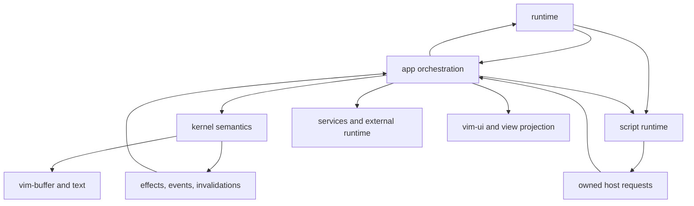
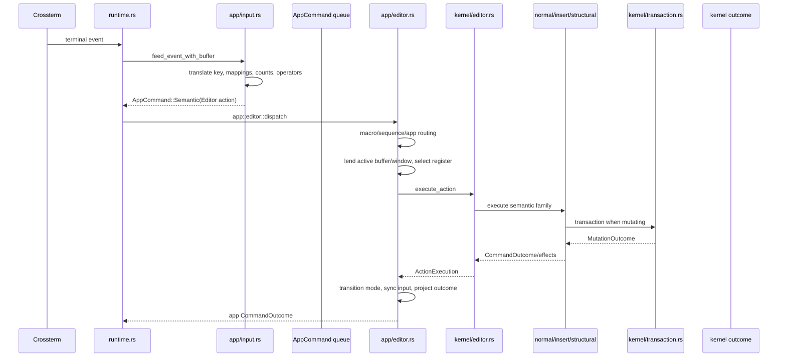
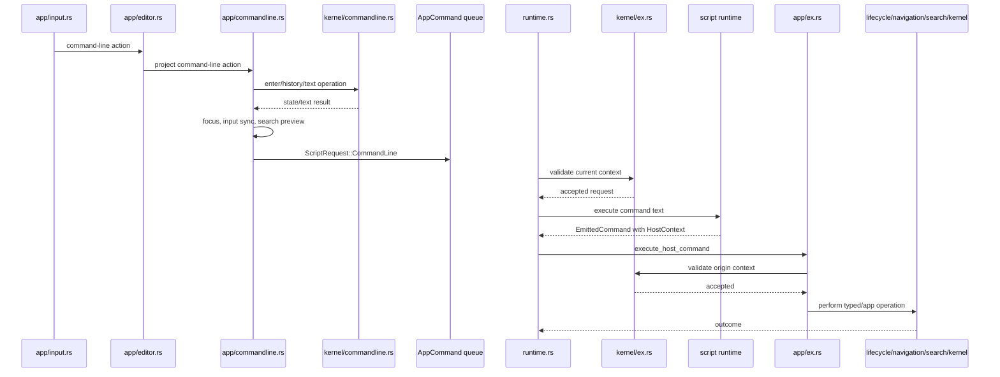
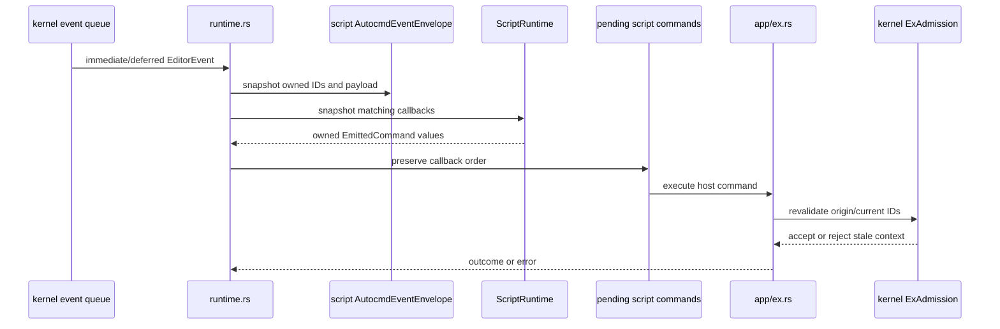
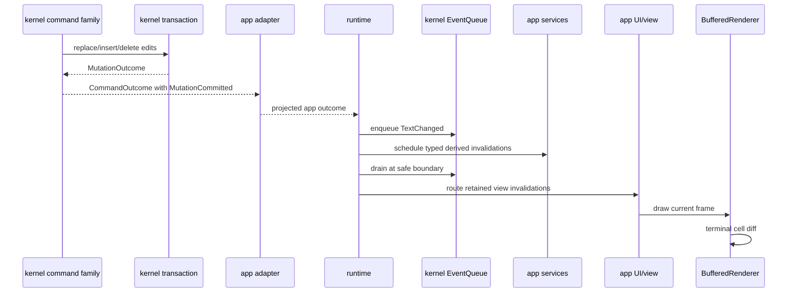
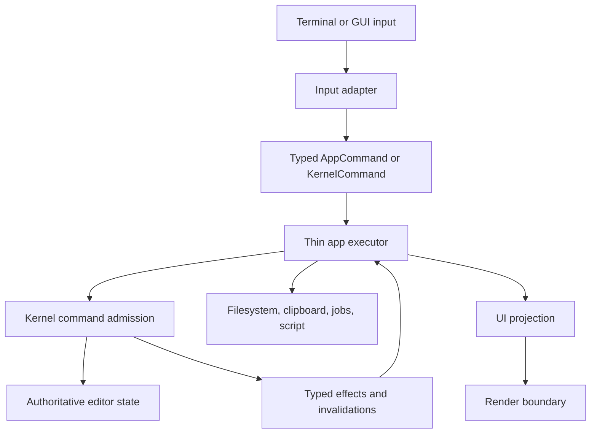

# NxVim Current Design and Ownership Inventory

## Purpose

This document describes the architecture that exists now under `src`, identifies redundant and transitional code, and defines the intended ownership boundary between `app`, `kernel`, `model`, `script`, `view`, and `runtime`.

It is an inventory, not a claim that the reset is complete.

The central rule is:

> The kernel decides what an editor operation means. The app supplies infrastructure, coordinates external systems, and projects kernel results into the UI.

`src/app` is therefore not deprecated. App modules are deprecated only when they duplicate kernel semantics, add forwarding-only layers, or preserve obsolete controller-style dispatch.

## Layer Responsibilities

### Kernel

The kernel owns deterministic editor semantics and authoritative editor state:

- current tab/window/buffer identity;
- buffers and semantic window/tab relationships;
- modes and mode transitions;
- Normal, Insert, Replace, and structural editing semantics;
- motions, operators, text objects, marks, selections, folds, and history;
- transactions and undo grouping;
- command context and semantic command classification;
- editor events;
- mutation facts, command effects, and redraw invalidation intent;
- stale-context admission at semantic boundaries.

The kernel must not depend on:

- `App`;
- terminal input APIs;
- runtime polling;
- script schedulers;
- filesystem/background services;
- rendering;
- app request envelopes.

### App

The app owns orchestration and infrastructure adaptation:

- application composition;
- terminal-input adaptation into logical `vim_input` actions;
- command queue routing;
- system clipboard integration until registers become fully kernel-owned;
- filesystem and background-worker coordination;
- script-runtime invocation;
- prompts and interactive confirmation;
- UI focus, layout, and semantic-to-concrete view projection;
- colorschemes and presentation feature switches;
- applying kernel effects at safe boundaries.

App code may choose where an operation is sent and how an external effect is fulfilled. It must not independently redefine motion ranges, mutations, mode rules, operator behavior, or transaction semantics.

### Model

`model` is currently a compatibility façade over kernel-owned buffer state plus command-line/search state. It should shrink as ownership converges.

### Script

`script` owns parsing, compilation, execution, host request conversion, mappings exposed by scripts, user commands, and autocommand registration/matching. Script code must emit owned requests and must not mutate editor state directly.

### View

`view` owns presentation components. It reads projected editor/UI state and renders text, statusline, tabline, and command line. It does not own editor semantics.

### Runtime

`runtime.rs` owns polling and safe-boundary sequencing:

- terminal events;
- queued app commands;
- script-host commands;
- service results;
- deferred event delivery;
- redraw admission and terminal flushing.

Runtime should eventually delegate command execution to one app executor rather than contain category-specific policy.

## Required Dependency Direction



Forbidden long-term directions:

```text
kernel -> app
kernel -> runtime
kernel -> script scheduler
kernel -> filesystem/background services
kernel -> renderer
```

## Current Violations and Transitional Dependencies

### Resolved: kernel dependency on app-owned `ExCommand`

The kernel no longer imports or implements behavior for `app::command::ExCommand`.

The replacement boundary is:

1. `app/ex.rs` translates the compatibility command envelope into kernel-owned `CommandMetadata`.
2. `EditorState::command_context_with()` combines those owned facts with the authoritative current context and character-search state.
3. `kernel::ExAdmission` remains limited to stable-context validation.

A source audit confirms there are currently no `crate::app` imports under `src/kernel`.

### Kernel editor admission uses concrete `vim_ui::WindowState`

Current file:

- `src/kernel/editor.rs`

The semantic action matrix is correctly out of `app`, but it still receives presentation-owned `WindowState`. This reflects the current location of selections, folds, and viewport state.

Required correction:

- move semantic selection/fold/cursor state behind a kernel-owned window state, or introduce a narrow semantic window-state interface;
- leave concrete geometry, rendering caches, and drawing state in `vim_ui`.

This is transitional coupling, not duplicate behavior.

### Kernel editor admission receives `vim_clipboard::Clipboard`

Current file:

- `src/kernel/editor.rs`

Registers are editor semantics, but the current object also represents clipboard infrastructure. Long term the kernel should own a register model and emit explicit system-clipboard effects when integration is required.

Preferred boundary:

```text
kernel register mutation
-> CommandEffect::WriteSystemClipboard
-> app applies the effect
```

For put operations, app should snapshot external clipboard content into an owned kernel command input rather than lend the complete clipboard service.

### `EditorModel` contains semantic state outside `EditorState`

Current file:

- `src/model/mod.rs`

Misplaced or transitional fields include:

- command-line mode and buffer identity;
- command/search history and history cursor;
- active search pattern and compiled regex;
- substitution preview state;
- status text.

Command-line/search/substitution semantic state should move to kernel-owned state. Presentation status/messages may remain app-owned.

## App File Inventory

Status meanings:

- **KEEP** — valid app responsibility.
- **KEEP, NARROW** — valid boundary containing transitional or overly broad code.
- **MOVE SEMANTICS** — retain an app adapter but move specified logic into kernel.
- **MERGE/DELETE** — behavior is valid but the file/type is a redundant forwarding layer.
- **RETIRE** — compatibility representation should disappear after callers migrate.

| File | Status | Current role | Required action |
|---|---|---|---|
| `src/app/mod.rs` | KEEP, NARROW | Composition root, `App`, synchronization, retained invalidation state | Keep composition. Reduce duplicated current window/tab state and broad mutable fields as ownership converges. Remove the obsolete claim that legacy semantic implementations remain. |
| `src/app/args.rs` | KEEP | CLI parsing | No kernel migration. |
| `src/app/input.rs` | KEEP | Crossterm-to-`vim_input` translation, mappings, pending input | Keep terminal adaptation. Kernel continues to own resulting semantic mode/state; avoid adding semantics here. |
| `src/app/editor.rs` | KEEP, NARROW | Thin kernel action adapter plus macros, sequences, repeat routing, window/lifecycle/command-line coordination and preview logic | Keep `execute_action` adapter temporarily. Move remaining semantic classification and repeat policy into kernel. Split command-line preview and app orchestration. Do not recreate `EditorHandler`. |
| `src/app/commandline.rs` | KEEP, NARROW | Handler-free projection for kernel-owned command-line state/editing; retains focus, search-preview adaptation, input synchronization, and queue submission | Keep app projection. Move search preview into the future kernel search state and replace `handles()` with typed routing when action admission is consolidated. |
| `src/app/command.rs` | RETIRE IN PART | Large compatibility `ExCommand` plus re-export of typed app requests | Retire `ExCommand` after script host emits typed app/kernel requests. Keep typed request definitions in a dedicated request module. Remove duplicated Debug boilerplate with the enum. |
| `src/app/typed_command.rs` | KEEP, PROMOTE | Typed `AppCommand` request categories | Make this the authoritative app request envelope and rename appropriately, likely `request.rs` or `command.rs`, after legacy `ExCommand` is removed. |
| `src/app/ex.rs` | KEEP, SPLIT | App execution of script-host commands, lifecycle/navigation/config/search/mutation orchestration | Keep app-owned orchestration. Replace the large `ExCommand` match with typed requests and route each category to its owner. Move raw semantic buffer replacement into a kernel API. |
| `src/app/application.rs` | KEEP | Colorscheme, feature switches, messages, app configuration | Keep presentation/application behavior. Route semantic option changes through kernel-owned option effects. |
| `src/app/lifecycle.rs` | KEEP | Save/edit/quit request routing and async save scheduling | Keep as lifecycle owner. Absorb valid logic from `lifecycle_ops.rs` and lifecycle parts of `operations.rs`. |
| `src/app/lifecycle_ops.rs` | MERGE/DELETE | Forwarding `LifecycleHandler` around `SharedOperations`, colorscheme, nohlsearch | Move lifecycle functions into `lifecycle.rs`; colorscheme/nohlsearch to `application.rs` or search owner. Delete handler struct/file. |
| `src/app/navigation.rs` | KEEP | App coordination of splits, tabs, buffers, and UI projection | Keep orchestration. Move semantic tab/window/buffer selection decisions to kernel APIs and retain only view projection. |
| `src/app/operations.rs` | MERGE/DELETE | Generic `SharedOperations` for save/edit/quit/buffer switch/split/focus | Dissolve by owner: lifecycle to `lifecycle.rs`, navigation to `navigation.rs`, semantic state changes to kernel, view effects to `ui.rs`. Delete generic type/file. |
| `src/app/range_ops.rs` | MOVE SEMANTICS, KEEP THIN ADAPTER | Resolves Ex ranges, reconstructs `vim_input::Action`, invokes generic editor path | Kernel should own typed resolved range/operator commands. App may retain access adaptation for current line/marks until semantic window state moves. Remove `RangeCommandHandler` and action reconstruction. |
| `src/app/search.rs` | MOVE SEMANTICS | Search request dispatch mutates search state and selections directly | Move search state, direction, matching, cursor outcome, and events into kernel. Keep only request routing. Merge with a future app search adapter if any infrastructure remains. |
| `src/app/substitute.rs` | SPLIT | Substitution matching/mutation mixed with interactive prompt orchestration | Move range matching, replacement planning, and transactions into kernel. Keep prompt lifecycle and choice-to-command conversion in app. Delete `SubstituteHandler` after split. |
| `src/app/prompt.rs` | KEEP | Prompt state and response routing | Keep UI interaction. Prompt payloads should produce typed app/kernel commands rather than call semantic helpers directly. |
| `src/app/config/mod.rs` | KEEP, REVIEW OWNERSHIP | Shared option registry/store | Keep app/presentation options. Semantic buffer/window options should be exposed through kernel mutation boundaries and typed `OptionSet` events. Avoid a second script-owned store. |
| `src/app/services.rs` | KEEP | Background workers, filesystem, Tree-sitter/indexer scheduling, clipboard and macro services | Keep infrastructure. Macro action storage and registers are candidates for kernel ownership; external execution remains app-owned. |
| `src/app/task_dispatcher.rs` | KEEP, RENAME OPTIONAL | Validates and applies asynchronous results | Keep in app. It may become `task_results.rs`; do not move background result application into kernel unless results are first converted to typed semantic commands. |
| `src/app/external_runtime.rs` | KEEP | Timers/jobs/channels/terminal integration boundary | Keep app-owned external infrastructure with stable IDs and owned events. |
| `src/app/ui.rs` | KEEP | UI setup, view effects, semantic-to-view synchronization | Keep. Continue reducing semantic decisions in this file. |
| `src/app/windows.rs` | KEEP DURING MIGRATION, SHRINK | Bridges kernel buffers with concrete `vim_ui::Window` state | Keep until semantic window state is kernel-owned. Then retain only projection/lookup helpers and delete duplicated window authority. |
| `src/app/outcome.rs` | RETIRE OR RENAME | Wrapper around kernel outcome plus view effects and quit convenience | Replace with clearly named `AppOutcome` or separate runtime control/view effects from `kernel::CommandOutcome`. Avoid two types named `CommandOutcome`. |

### Already retired app files

These should not return:

- `src/app/legacy_editor.rs`;
- `src/app/editor_handler.rs`;
- `src/app/buffer_handler.rs`;
- `src/app/window_handler.rs`;
- `src/app/commandline_handler.rs`.

Their former semantic/controller behavior is now kernel-owned or represented by explicit app orchestration.

## Kernel File Inventory

| File | Status | Role and follow-up |
|---|---|---|
| `src/kernel/state.rs` | KEEP | Authoritative editor state. It now accepts neutral `CommandMetadata`; absorb command-line/search/register state over time. |
| `src/kernel/command.rs` | KEEP, REFACTOR | Kernel command/context and neutral metadata types. App-owned command implementations are removed; centralize action traits and reduce repeated action classification. |
| `src/kernel/editor.rs` | KEEP AS ADMISSION, SPLIT INTERNALLY | Current semantic action admission matrix. Continue dispatching into family modules; replace concrete clipboard/UI state dependencies. It must not grow into another monolithic legacy editor. |
| `src/kernel/normal.rs` | KEEP, SPLIT | Authoritative Normal semantics. Split into motion/operator/text-object/marks/folds/history modules because it is already about 2,400 lines. |
| `src/kernel/insert.rs` | KEEP | Insert/Replace/open-line transaction semantics. |
| `src/kernel/structural.rs` | KEEP | Put/join/indent structural mutations. |
| `src/kernel/transaction.rs` | KEEP | Shared mutation and undo entry point. All production semantic edits should converge here. |
| `src/kernel/outcome.rs` | KEEP | Typed mutation outcomes, effects, redraw requests, and invalidations. Add explicit infrastructure effects instead of lending services to kernel. |
| `src/kernel/events.rs` | KEEP | Stable-ID editor event queue. Complete destructive and nested callback behavior. |
| `src/kernel/ex.rs` | KEEP | Stable-context admission only. Do not move app Ex orchestration back here. |
| `src/kernel/windows.rs` | KEEP, EXPAND SEMANTIC OWNERSHIP | Semantic window identity/buffer relationships. Eventually own cursor/selection/fold state or a semantic view state. |
| `src/kernel/tabs.rs` | KEEP | Semantic tab pages and active/previous window relationships. Ensure UI layout is projection rather than competing authority. |
| `src/kernel/ids.rs` | KEEP | Stable semantic IDs. |
| `src/kernel/mod.rs` | KEEP | Kernel public boundary. Export only types needed by app/script/runtime. |

## Redundancy Summary

### Physically redundant files to remove after focused migration

1. `src/app/lifecycle_ops.rs`
2. `src/app/operations.rs`

### Compatibility types to retire

1. `app::command::ExCommand`
2. duplicate app/kernel `CommandOutcome` naming and wrapper shape
3. generic `*Handler` and `SharedOperations` types where plain owner functions suffice

### Misplaced semantic behavior to move into kernel

1. search state and cursor matching from `search.rs`, `commandline.rs`, and `EditorModel`;
3. substitution planning/matching/mutation from `substitute.rs`;
4. Ex range interpretation and typed range operations from `range_ops.rs`;
5. remaining repeat/action trait classification from `editor.rs`;
6. semantic window/buffer/tab selection decisions from `operations.rs`, `navigation.rs`, and `windows.rs`;
7. register and macro semantic state currently split between kernel and app services;
8. raw script-host buffer replacement currently implemented in `app/ex.rs`.

### App behavior that must not move into kernel

- terminal/Crossterm translation;
- script VM scheduling and compilation;
- filesystem I/O and background task spawning;
- system clipboard calls;
- UI focus, concrete split realization, drawing, and terminal flushing;
- colorscheme loading;
- prompt presentation;
- timer/job/channel/process implementation.

## Current Input and Action Flow

### Physical key to semantic editor action



Important current limitation: `app/editor.rs` still performs macro, sequence, repeat, window, lifecycle, and command-line routing before kernel action admission. Some is valid orchestration; semantic repeat/action classification should continue moving to kernel.

### Pending and invalid input

```text
Crossterm event
-> app::InputAdapter
-> vim_input::Resolver
-> ResolveOutcome::Pending / Invalid
-> AppCommand::Input
-> runtime updates kernel PendingCommandState and statusline invalidation
```

The resolver owns key grammar. The kernel owns persisted semantic pending-command state.

## Current Command-Line and Ex Flow



This flow is controlled and context-safe, but still has redundant representations:

```text
CommandLineRequest
-> script CommandRequest
-> app ExCommand
-> app/lifecycle/navigation/semantic operation
```

Target flow:

```text
CommandLineRequest
-> script parser/host
-> typed AppCommand or kernel command
-> owning app/kernel executor
```

The script host must stop producing the compatibility `ExCommand` enum.

## Current Script and Autocommand Flow



The kernel does not call script callbacks directly. Runtime delivers them at a safe boundary, and app executes resulting host commands after kernel admission.

## Current Mutation, Event, and Redraw Flow



Kernel commands do not call app rendering functions. They return facts and intent. Runtime/app apply those results exactly once.

## Current Async Service Flow

```text
app command
-> app::Services spawns owned task with TaskOwner
-> background result
-> Runtime polls service results
-> AppCommand::Service
-> app::task_dispatcher validates buffer/window/revision/task/generation
-> accepted result updates derived state
-> targeted redraw invalidation
```

Background workers must never retain mutable editor references or apply stale results.

## Does the Kernel Call App Functions?

It should not.

Current production semantic execution is called in this direction:

```text
app -> kernel
```

The previous type-level inversion through app-owned `ExCommand` has been removed. `app/ex.rs` now supplies neutral `CommandMetadata`, and a source audit finds no `crate::app` imports under `src/kernel`.

No new kernel code should import `crate::app`.

## Target End State



A feature should normally require:

1. one typed command/request declaration;
2. one owning kernel family implementation for semantic behavior;
3. one app effect adapter only if external infrastructure is required;
4. focused tests at the permanent owner.

It should not require adding another controller handler, generic fallback, or parallel semantic implementation.

## Recommended Cleanup Order

1. [x] Remove `ExCommand` dependencies from `kernel/command.rs` and `kernel/state.rs`.
2. [x] Move command-line state/history/edit semantics into kernel; delete `CommandlineHandler`.
3. Move search semantics into kernel and remove duplicate search implementations in `app/search.rs` and `app/ex.rs`.
4. Introduce typed kernel range commands; stop converting Ex ranges back into `vim_input::Action`.
5. Split substitution semantics from app prompt orchestration.
6. Merge and delete `lifecycle_ops.rs`.
7. Dissolve and delete `operations.rs` by moving functions to lifecycle/navigation/UI/kernel owners.
8. Retire `ExCommand` and promote typed app requests as the only app queue envelope.
9. Rename or remove app `CommandOutcome` so the kernel/app distinction is explicit.
10. Move semantic window state and registers into kernel-owned structures, eliminating concrete `WindowState` and clipboard service dependencies from `kernel/editor.rs`.
11. Split `kernel/normal.rs` and `kernel/editor.rs` by semantic family without changing ownership or creating handler frameworks.
12. Extract category execution from `Runtime::run` into one app executor.

## Deletion Rule

Do not delete an app file merely because it calls the kernel.

Delete or merge it when:

- it is forwarding-only;
- its semantic behavior has a permanent kernel owner;
- all production callers use the permanent path;
- any legitimate infrastructure adaptation has moved to a clearly named app owner;
- focused tests and compile gates pass;
- source audits show no compatibility fallback.

The goal is not “no app.” The goal is:

> No duplicate semantic editor inside app, no infrastructure inside kernel, and one explicit command path between them.
