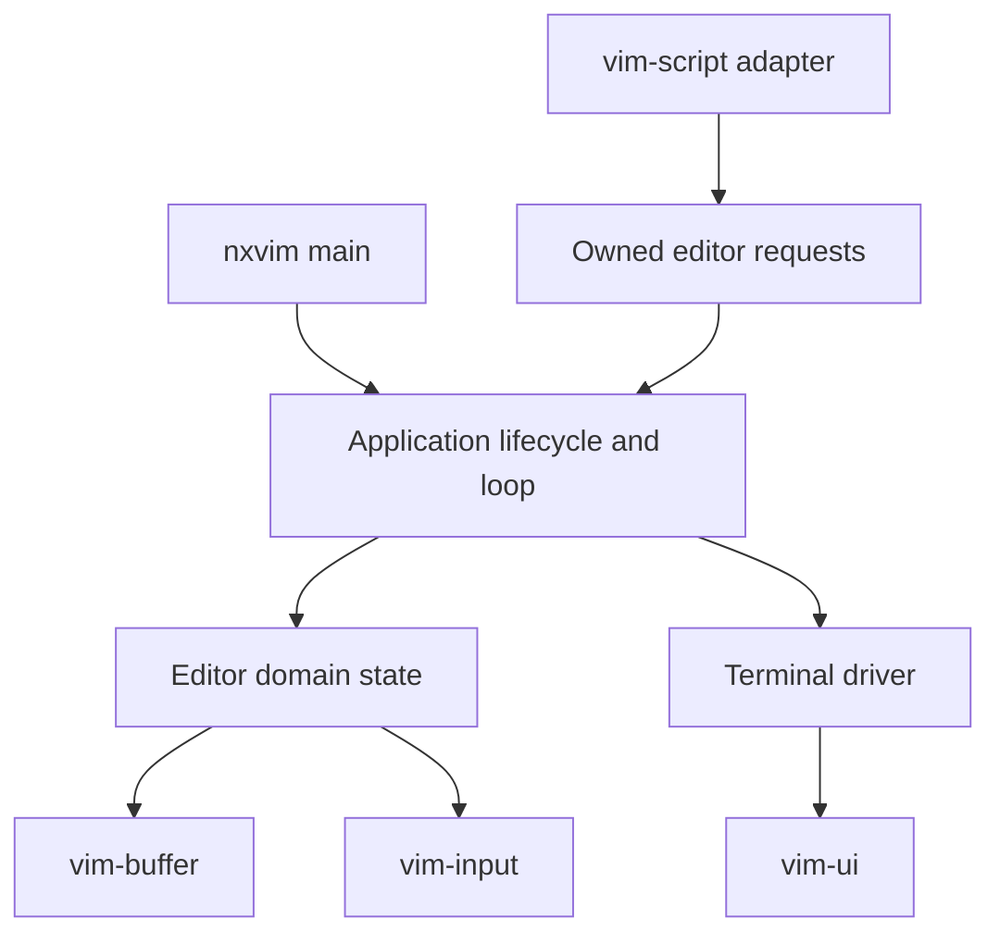

# NXVIM Architecture and Implementation Roadmap

NXVIM is a Vim-like terminal editor built from the component crates in this workspace and selected Zed text primitives. This document is the integration plan for the `nxvim` binary. It intentionally starts small: establish ownership, lifecycle, and a testable event loop before connecting rendering, Vimscript, or editing.

## Principles

1. **One owner for mutable editor state.** The application loop owns `Editor` and is the only place that applies state changes.
2. **Resolve input once, then execute the action directly.** Terminal input becomes `vim_input::Key`; the resolver produces `vim_input::Action`; `Editor` and `Document` execute that action without translating it into a duplicate editor-command enum. Separate host/application commands are reserved for operations that do not originate as input actions.
3. **Store IDs, not references.** Long-lived structs contain `BufferId`/`WindowId`, never references into managers. Data is borrowed only for the duration of a method call.
4. **Snapshots cross read boundaries.** Rendering and script requests should receive snapshots or owned request data, not live mutable buffers.
5. **No self-referential `Editor`.** A field must not borrow another field. In particular, do not make the script host hold `&Editor`, and do not retain `BufferViewModel<'_>` between calls.
6. **Keep terminal resources outside domain state.** Terminal setup, restoration, polling, and rendering belong to an application/driver layer. `Editor` should be unit-testable without a terminal.
7. **Add concurrency only at an explicit boundary.** Phase 1 is synchronous. Async Vimscript and background work will communicate with the editor through owned requests and responses.
8. **Use the crates that exist.** Introduce adapters where crate identities differ; for example, `vim_buffer::BufferId` and `vim_ui::BufferId` are distinct types and must not be treated as interchangeable.
9. **Never circumvent the borrow checker.** A borrow-checker error is evidence that an ownership boundary, lifetime, or operation order needs review. Do not make code compile by adding `Rc<RefCell<_>>`, `Arc<Mutex<_>>`, global mutable state, leaked allocations, raw pointers, `unsafe`, excessive cloning, remove-and-reinsert patterns, or channels whose only purpose is to evade a valid local borrow. Interior mutability, synchronization, cloning, and channels are allowed only when required by the actual runtime semantics and documented at that boundary—for example, the owned async Vimscript request channel. Prefer split borrows, shorter scopes, IDs, snapshots, owned messages, and small methods with clear ownership.

## Target dependency direction



The binary is the composition root. Component crates remain editor-agnostic and must not depend on `nxvim`.

---

# Phase 1 — Application Skeleton, State, Globals, and Loop

## Goal

Produce a compiling, runnable shell that:

- constructs all foundational state;
- creates one empty buffer;
- initializes NXVIM/Vim-compatible global values;
- enters a deterministic event loop;
- handles quit and terminal resize events;
- always restores the terminal on normal return or error;
- can be tested without opening a real terminal.

Phase 1 instantiates the Vimscript scheduler and host runtime, registers the first editor commands, and establishes its owned command boundary. It does **not** yet compile or execute user Vimscript, render a real buffer, edit text, install callbacks, or implement `vim_ui::UIContext`.

## Proposed source layout

```text
src/
├── main.rs       # Parse startup input, compose concrete dependencies, report errors
├── app.rs        # Application lifecycle and run loop
├── document.rs   # Buffer-local model/controller, selections, motions, viewport
├── editor.rs     # Editor-wide state and direct Action dispatch
├── event.rs      # Terminal/application events and async host commands
├── globals.rs    # Global namespace and initialization
├── script.rs     # Vimscript scheduler, host runtime, and editor command bridge
└── terminal.rs   # TerminalSession guard and EventSource abstraction
```

Keep modules private until another crate genuinely needs them. The `nxvim` package can add `src/lib.rs` later if integration tests need a public library surface.

## Core types

The exact names may evolve, but ownership should follow this shape:

```rust
use std::collections::HashMap;
use vim_buffer::{BufferId, BufferManager, Mutator};
use vim_input::{Keymap, Mode, Resolver};

pub struct Editor {
    buffers: BufferManager,
    mutator: Mutator,
    document: Document,
    input: InputState,
    globals: Globals,
    scripts: ScriptRuntime,
    message: Option<Message>,
    screen: ScreenSize,
    lifecycle: Lifecycle,
}

pub struct InputState {
    mode: Mode,
    keymap: Keymap,
    resolver: Resolver,
    command_line: String,
}

#[derive(Debug, Clone, Copy, PartialEq, Eq)]
pub struct ScreenSize {
    pub columns: u16,
    pub rows: u16,
}

#[derive(Debug, Clone, PartialEq, Eq)]
pub struct Message {
    pub kind: MessageKind,
    pub text: String,
}

#[derive(Debug, Clone, Copy, PartialEq, Eq)]
pub enum MessageKind {
    Info,
    Warning,
    Error,
}

#[derive(Debug, Clone, Copy, PartialEq, Eq)]
pub enum Lifecycle {
    Running,
    ExitRequested,
}
```

### Why these boundaries

- `BufferManager` owns buffers. `Document` is the model/controller for one editor view and owns its `BufferId`; `Editor` must not mirror that identity in an `active_buffer` field. Future focus/window state selects a `Document`, and that document identifies its buffer.
- Each `Document` owns its `SelectionSet`, desired cursor-column metadata, and viewport. `SelectionSet` is the sole authority for cursor and selection positions. It is never empty, its first element is the primary selection, and the primary selection's head is the main cursor. Do not add a parallel standalone cursor position; display positions are derived from the primary anchor against the document snapshot.
- `Mutator` is independent state in the current `vim-buffer` API. It should be borrowed only while applying one command and must not retain a buffer borrow.
- `InputState` groups fields that usually change together. `mode` is the authoritative editor mode; when it changes, update `Resolver` in the same method with `resolver.set_mode(mode)`.
- UI state is initially limited to terminal dimensions and a message. Do not place `vim_ui::Ui` or a renderer in `Editor`; drawing `Ui` with `Editor` as its context would otherwise encourage conflicting borrows of the same aggregate.
- `ScriptRuntime` owns `Scheduler` and `HostRuntime`. The `Host` never borrows `Editor`; it sends owned `EditorCommand`s across the explicit async boundary. This channel exists because host futures are `'static` and may outlive a VM quantum, not as a workaround for a local borrow conflict.

## Globals

Use a dedicated wrapper rather than exposing a raw map throughout the application:

```rust
#[derive(Debug, Clone, PartialEq)]
pub enum GlobalValue {
    Null,
    Bool(bool),
    Integer(i64),
    String(String),
}

#[derive(Debug, Default)]
pub struct Globals {
    values: HashMap<String, GlobalValue>,
}
```

Phase 1 globals:

| Name | Value | Notes |
|---|---:|---|
| `v:version` | chosen compatibility version | Define one named constant; do not scatter a magic integer. |
| `v:true` | `true` | Read-only compatibility value. |
| `v:false` | `false` | Read-only compatibility value. |
| `v:null` | `Null` | Read-only compatibility value. |
| `v:progname` | `nxvim` | Useful immediately for diagnostics. |
| `g:nxvim` | `true` | Feature detection for future scripts. |

`Globals` should expose narrow operations such as `get`, `define`, and later `set`. Built-in `v:` values should be marked read-only before script assignment exists.

Do not use `vim_script::runtime::Value` as the editor's permanent storage type yet. That would couple core application state to VM representation before the script boundary is settled. A later adapter can convert `GlobalValue` to `Value` when installing VM globals.

## Events and commands

```rust
pub enum AppEvent {
    Key(vim_input::Key),
    Resize(ScreenSize),
    Tick,
    EndOfInput,
}

pub enum HostCommand {
    Quit,
    NewBuffer,
}
```

The loop reads an `AppEvent` and passes it to `Editor::handle_event`. Key events are resolved once by `vim-input`; the resulting `Action` is applied directly. Editor-wide actions are handled by `Editor`, while buffer-local navigation and editing actions are delegated to the focused `Document`. Host/script requests use their own owned command boundary because they originate asynchronously rather than from `vim-input`.

Event handling must not poll the terminal or retain buffer borrows. Avoid calls such as `self.ui.handle_event(..., self)`, which try to mutably borrow a field and the whole `Editor` simultaneously.

## Application and terminal boundaries

```rust
pub trait EventSource {
    fn next_event(&mut self) -> std::io::Result<AppEvent>;
}

pub struct Application<S> {
    editor: Editor,
    events: S,
}

impl<S: EventSource> Application<S> {
    pub fn run(&mut self) -> Result<(), AppError> {
        while self.editor.is_running() {
            let event = self.events.next_event()?;
            let commands = self.editor.translate_event(event);
            for command in commands {
                self.editor.apply(command)?;
            }
        }
        Ok(())
    }
}
```

The concrete crossterm implementation maps terminal events into `AppEvent`. Unsupported events can map to `NoOp` or be ignored at the driver boundary.

Use a `TerminalSession` RAII guard:

- constructor enables raw mode and enters the alternate screen;
- `Drop` makes a best effort to show the cursor, leave the alternate screen, and disable raw mode;
- explicit `restore()` returns cleanup errors where possible;
- setup must roll back already-completed steps if a later setup step fails.

Do not call `process::exit` from the loop; return normally so destructors run.

## Construction order

`Editor::new(screen)` should:

1. create `BufferManager`;
2. create one empty buffer and immediately copy its `BufferId`;
3. finish the temporary mutable borrow returned by `BufferManager::create`;
4. construct `Mutator`, `Keymap`, and `Resolver::new(Mode::Normal)`;
5. initialize globals;
6. return a fully valid `Editor` in `Lifecycle::Running`.

Avoid constructors that produce partially initialized state. Prefer `Result<Self, EditorError>` once startup can fail.

## Phase 1 behavior

- `Esc` clears pending resolver state and returns to Normal mode.
- `Ctrl-C` and a minimal resolved quit action request exit. Whether plain `q` quits should follow the existing `vim-input` keymap rather than a hard-coded terminal shortcut.
- Resize updates `ScreenSize` with no rendering yet.
- End-of-input requests a clean exit, which makes fake event sources and non-interactive execution deterministic.
- Other keys may pass through `vim_input::Resolver`, but only actions explicitly supported by Phase 1 become commands. Unsupported resolved actions set an informational message or become `NoOp`; they must not panic.

## Borrow-checker rules for implementation

- Copy IDs out of temporary manager borrows before accessing another editor field.
- Use short helper methods (`set_mode`, `apply_action`, `Document::apply_action`) rather than taking several field borrows in the run loop.
- If one command needs both `mutator` and `buffers`, split the fields explicitly inside a small method:

  ```rust
  let Editor { buffers, mutator, .. } = self;
  // use `buffers` and `mutator` here; do not call another `&mut self` method
  ```

- Never store `&Buffer`, `BufferSnapshot<'_>`-like borrowed views, `UIContext` views, or transactions in `Editor`.
- A `Transaction<'_>` must be created, populated, and committed within one method; it must not survive an event-loop iteration.
- Callbacks must emit owned events into a queue. They must not capture `&mut Editor`.
- Do not introduce `Rc<RefCell<_>>`, `Arc<Mutex<_>>`, or `unsafe` merely to bypass ownership errors. Their need would indicate a boundary that should be redesigned first.

## Phase 1 tests and completion criteria

Unit tests:

- default globals contain the expected names, values, and read-only policy;
- editor construction creates exactly one active buffer;
- mode changes keep `InputState.mode` and `Resolver::mode()` synchronized;
- resize changes only screen state;
- quit changes lifecycle without panicking;
- unsupported input is safe;
- a fake event source drives resize then quit and the loop terminates.

Validation:

```sh
cargo fmt --all --check
cargo check -p nxvim
cargo test -p nxvim
cargo clippy -p nxvim --all-targets -- -D warnings
```

Phase 1 is complete when `cargo run -p nxvim` enters raw mode, accepts the minimal exit path, and restores the terminal, while the same loop passes tests with a fake event source.

---

# Phase 2 — Rough Draft: Read-Only Single-Buffer Screen

## Goal

Render one buffer and move one cursor without allowing document mutation. This is the smallest useful vertical slice after the lifecycle is trustworthy.

## Sensible scope

1. Accept zero or one file path. Use `BufferManager::load`; use the existing empty buffer when no path is provided.
2. Add editor-owned view state:
   - active cursor position;
   - first visible line and horizontal offset;
   - line-number preference;
   - dirty/redraw flag.
3. Introduce a small ID adapter between `vim_buffer::BufferId` and `vim_ui::BufferId`. Keep the mapping explicit and tested; do not rely on matching integer representations.
4. Build a **read-only render model** from a short-lived buffer snapshot. The model should own or safely scope everything needed for one frame.
5. Configure one `vim_ui::Ui` window with `BufferView`, plus a status line if the current APIs support composition cleanly. Defer tabs, splits, floating windows, and command-line overlays.
6. Keep `Ui` and `BufferedRenderer` in the application/presentation layer. Render using a temporary context adapter borrowing only the editor fields needed for that frame.
7. Translate crossterm keys once, at the terminal boundary, then feed `vim-input`. Do not maintain separate UI and input key representations deeper in the editor.
8. Implement read-only motions first: `h`, `j`, `k`, `l`, `0`, `$`, `gg`, and `G`. Clamp positions to valid UTF-8/text boundaries and preserve a desired display column for vertical movement.
9. Handle resize by resizing UI state, rebuilding layout, marking the frame dirty, and redrawing.
10. Render only when dirty; initially a full logical frame is acceptable because `BufferedRenderer` performs terminal diffs.

## Questions to resolve during Phase 2

- What exact snapshot/line adapter best implements `vim_ui::LineSource` without cloning the complete file each frame?
- Should cursor positions be byte offsets, Zed points, or an editor-specific position converted at boundaries?
- Can statusline and buffer views coexist in the current `LayoutNode` cleanly, or should the first frame render the status area outside `Ui`?
- Which layer owns display-width calculations for tabs, combining characters, emoji, and wide glyphs?

Answer these with focused prototypes and tests before designing multi-window state.

## Completion criteria

- `nxvim path/to/file` displays UTF-8 text in a single viewport;
- required motions are bounded and never panic on empty lines or multibyte text;
- resize redraws correctly;
- no operation mutates the buffer;
- terminal cleanup still works after render or input errors;
- motion and viewport behavior are unit-tested without a terminal.

---

# Possible Later Phases

These are directional and should be refined at the end of each preceding phase.

## Phase 3 — Modes, command line, and action dispatch

- Complete raw-key to `vim_input::Key` translation.
- Support Normal, Insert, Visual, and Command mode transitions.
- Add command-line editing and a small native command registry (`quit`, `edit`, `enew`).
- Keep Ex command dispatch native initially; do not require the full VM for basic editor lifecycle.

## Phase 4 — Editing transactions and history

- Apply insert/delete/change actions through `vim_buffer::Mutator` and short-lived transactions.
- Group insert sessions into intentional undo units.
- Use anchors/snapshots for cursor and selection adjustment.
- Implement undo/redo and modified-state reporting.
- Add property tests around UTF-8 boundaries and action sequences.

## Phase 5 — Vimscript host integration

- Design an owned request/response bridge for `vim_script::host::Host`.
- Extend the existing `ScriptRuntime` from command registration to source compilation, VM task spawning, and scheduler polling.
- Convert editor globals into VM globals and define scope/write rules.
- Add buffer-read capabilities first; grant mutation and filesystem capabilities incrementally.
- Ensure async host futures never hold editor borrows across an await point.

## Phase 6 — Windows, splits, tabs, and overlays

- Add editor-owned window/tab models and explicit mappings to `vim_ui` IDs.
- Give each window independent cursor and viewport state.
- Add split layout, focus movement, command-line overlay, messages, tabline, and statusline.
- Keep buffers independent of views so one buffer can appear in multiple windows.

## Phase 7 — Vim behavior depth

- Operators plus motions, counts, registers, marks, text objects, search, repeat, and macros.
- Visual character/line/block selections.
- Buffer-local mappings and options.
- Autocommands emitted from owned event queues with reentrancy rules.

## Phase 8 — Files, jobs, clipboard, and external changes

- Safe write/reload workflows and swap/recovery policy.
- External-change detection and conflict prompts.
- Clipboard providers and background jobs behind capability boundaries.
- Structured error reporting and message history.

## Phase 9 — Compatibility and performance

- Differential tests against a pinned Vim version for deliberately supported behavior.
- Unicode/display-width test corpus.
- Render, rope-edit, startup, and large-file benchmarks.
- Profile before optimizing; preserve snapshots and incremental redraw where measurements justify them.

## Out of scope until explicitly planned

- Claiming full Vim compatibility;
- lock-free or multi-threaded editor mutation;
- plugin ABI stability;
- unrestricted script filesystem/process/network access;
- multi-window architecture before a correct single-window vertical slice.
