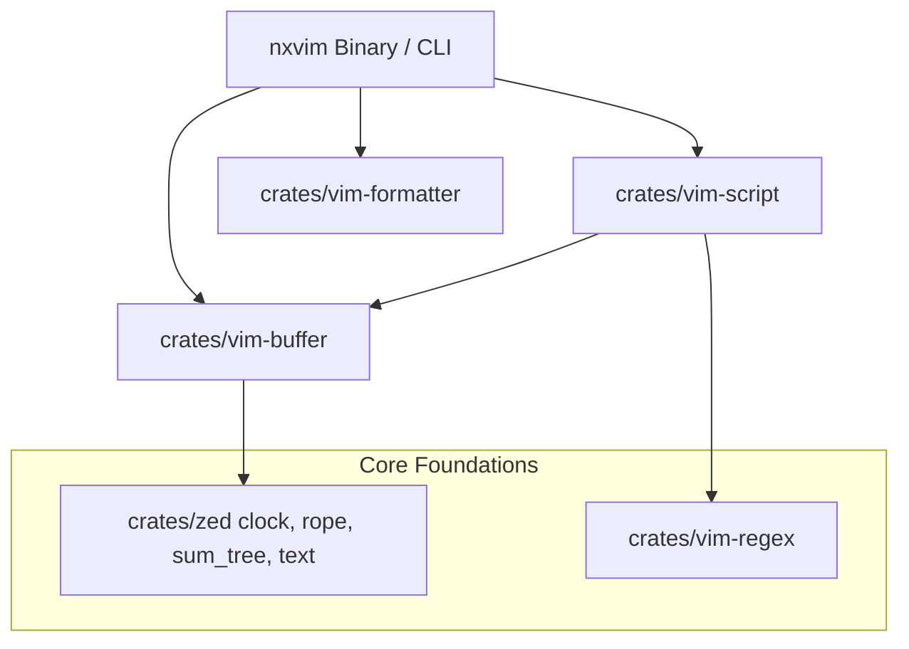

# nxvim

`nxvim` is a **Vim-inspired terminal text editor** written in Rust, powered by Zed's ultra-high-performance Rope + SumTree-backed text buffers and concurrent snapshot technologies.

It bridges the speed and safety of Rust, the rock-solid collaborative/concurrent editing foundation of Zed, and the extensive editing features, selection models, and scripting capabilities of Vim.

---

## Key Features

- **Zed Rope Engine**: Built on a direct extraction of Zed's `text::Buffer` (`rope` and `sum_tree` crates). Optimized for fast operations on massive files, metadata-stable positioning, and non-blocking background workers.
- **Vim Behavioral Alignment**: Target compatibility is observable Vim behavior (pinned to upstream Vim **v9.2.0843**).
- **Atomic Multi-Cursor & Visual-Block Support**: Plans all cursor modifications against an immutable pre-transaction snapshot and applies edits as one atomic batch transaction.
- **Vimscript VM Engine**: Lexer, parser, compiler, and stack-based Virtual Machine runtime for compiling and executing Vimscript expressions and statements (both synchronously and asynchronously).
- **Customizable Statusline Formatting**: High-performance string formatting matching Vim's `statusline` formatting rules (supporting `%f` file names, `%m` modified indicators, `%n` buffer IDs, alignments `%=`, and dynamic evaluations).
- **Headless Execution / CLI Scripting**: Direct script evaluation via flags (`--cmd`, `-c`, `-S`), allowing files to be modified, verified, or reformatted programmatically.

---

## Workspace Architecture

`nxvim` is organized as a nested Cargo workspace of editor-agnostic crates to encourage reusability and clean boundaries.



### Components and Crates

- **`nxvim` (App binary)**: The main terminal-based UI and application shell. Uses `crossterm` for rendering, screen buffering, and raw-mode inputs. Translates interactive keyboard inputs into script executions and coordinates headless evaluations.
- **`crates/vim-buffer`**: High-fidelity, editor-agnostic, Vim-compatible buffer and buffer lifecycle manager. Manages atomic transactions, stable anchor-backed selections (`VimSelection`), special marks (`MarkSet`), undo tree / command grouping (`UndoTree`), options, and synchronous event callbacks.
- **`crates/vim-script`**: Compiles and executes Vimscript. Exposes functions (`bufnr`, `getline`, `setline`), variables, commands, and interfaces with the underlying host.
- **`crates/vim-formatter`**: Evaluates and renders formatted strings, modeled after Vim's `statusline` specification. Parses format templates into a compiled AST and renders them efficiently with syntax styles.
- **`crates/vim-regex`**: Low-level Vim-compatible regular expression search and match library.
- **`crates/vim-input`**: Key bindings, command mappings, and keyboard input interpreters.
- **`crates/vim-ui`**: Layout structures, windows, status lines, and terminal drawing logic.
- **`crates/zed`**: Generated extraction of foundation libraries from the upstream Zed editor (`clock`, `rope`, `sum_tree`, and `text`).

---

## CLI Options

`nxvim` can be run interactively or headlessly for testing and scripting.

```sh
nxvim [options] [files...]
```

| Argument / Option | Description |
| --- | --- |
| `[files...]` | File paths to open into separate buffers at startup. |
| `--clean` | Skip all startup/user initialization scripts. |
| `--cmd <command>` | Execute `<command>` (Vimscript statement) *before* loading any files. |
| `-c <command>` | Execute `<command>` (Vimscript statement) *after* loading the first file. |
| `-S <script_file>` | Source and execute the Vimscript file `<script_file>` at startup. |
| `--` | Explicitly separates arguments/options from file paths. |

---

## Getting Started

### Prerequisites

- [Rust Toolchain](https://rustup.rs/) (supporting Edition 2024).

### Running Interactively

Run the text editor inside your terminal:

```sh
cargo run
```

Inside the interactive editor:
- Use standard text typing.
- Open the command-line by typing `:` and type a command (e.g., `:quit` to exit, `:setline(1, 'Hello Rust!')`).
- Move between command history with `Up` and `Down` arrow keys.

### Running in Headless Scripting Mode

Load a file, modify its contents using Vimscript headlessly, and print the results:

```sh
cargo run -- input.txt -c "let res = setline(1, 'Updated first line')" -c "write" -c "quit"
```

---

## Testing Strategy

`nxvim` relies on a multi-tiered test suite to guarantee safety, performance, and Vim behavior equivalence:

1. **Workspace Unit/Integration Tests**:
   ```sh
   cargo test --workspace
   ```
2. **Buffer Specific Phase Tests**:
   Individual phases of the buffer engine (`crates/vim-buffer`) can be tested independently:
   ```sh
   cargo test -p vim-buffer --test phase4_manager
   cargo test -p vim-buffer --test phase4_callbacks
   ```
3. **Property Testing**:
   Generates random Unicode texts, edit operations, and transaction scenarios to test metric-seeking round trips and selection-mapping stability. Property tests are opt-in to keep normal builds fast:
   ```sh
   cargo test -p vim-buffer --features property-tests --test phase1_properties
   ```
4. **Differential Vim Testing**:
   Validates observable state (revisions, line states, marks, event delivery order) against actual upstream Vim `v9.2.0843` behavior.

---

## Licenses and Provenance

- First-party workspace code in `nxvim`, `crates/vim-buffer`, `crates/vim-script`, `crates/vim-formatter`, etc., is licensed under the same terms as **Vim** or custom compatible licensing, permitting distribution and modification.
- Extracted Zed foundations under `crates/zed` preserve upstream licensing: `clock`, `rope`, and `text` are under **GPL-3.0-or-later**, while `sum_tree` is licensed under **Apache-2.0**. Distribution of binary artifacts combining GPL dependencies must remain compatible with GPL-3.0 terms.
