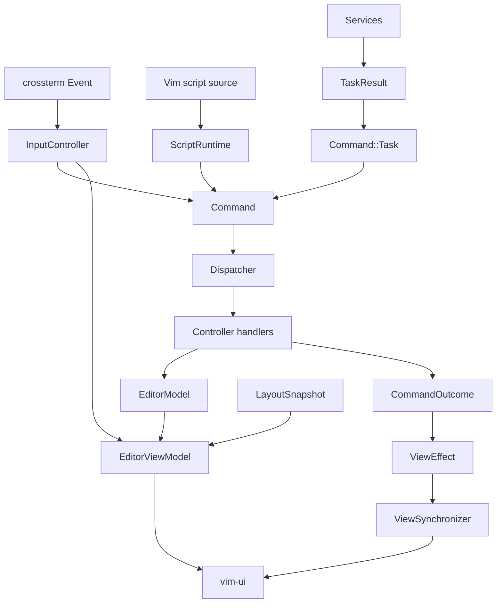
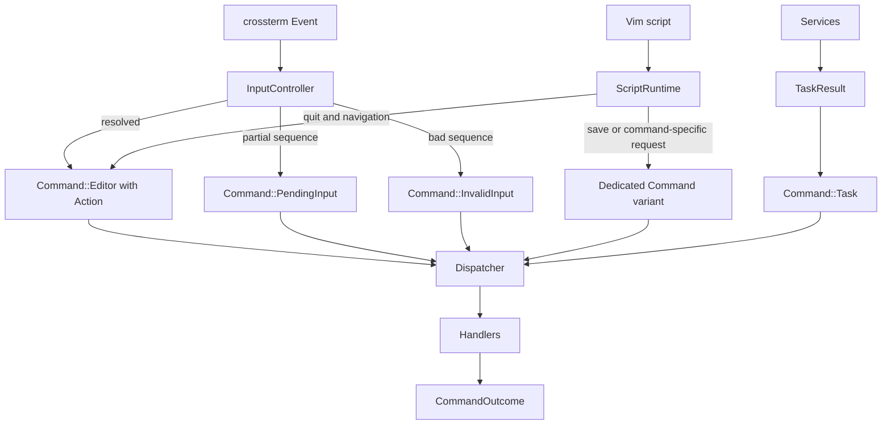

# nxvim Architecture

This document describes the architecture implemented by the current source tree and the planned simplification of command normalization. The code is authoritative when this document and the implementation disagree.

## Current architecture

`nxvim` uses an MVC-oriented architecture with an explicit runtime and composition root.



### Current command and action types

The current implementation has several representations between an event source and dispatch:

| Type | Location | Current responsibility |
|---|---|---|
| `vim_input::Action` | `crates/vim-input/src/action.rs` | Editor-agnostic resolved Vim intent, including motions, edits, mode changes, and editor/window requests. |
| `Command` | `src/controller/command.rs` | Application dispatch envelope for editor actions, pending/invalid input, save/write requests, and task results. |
| `CommandOutcome` | `src/controller/command.rs` | Dispatch result containing redraw, quit, and concrete view effects. |
| `vim_buffer::Action` | `crates/vim-buffer/src/mutator.rs` | Buffer-domain mutation request. This is separate from application command normalization and is not part of this refactor. |

The current normalization paths are:

```text
crossterm::Event
  -> InputController::feed_event
  -> Command
  -> Dispatcher

Vim script
  -> ScriptRuntime / editor host
  -> Command::Editor or Command::Save
  -> Dispatcher

TaskResult
  -> Command::Task
  -> Dispatcher
```

`InputController` and the application script adapter now emit `Command` directly. Generic `vim_script` parsing still uses `CommandRequest` as its source-domain representation, but the binary adapter normalizes resolved requests without introducing a second application dispatch enum.

## Target command flow

All event sources should produce the application-level `Command` at their boundary. Keep `vim_input::Action` as the nested editor-intent type; do not merge task results or input-resolution state into it.



The intended vocabulary is:

```text
vim_input::Action = what the user wants the editor to do
controller::Command = something the application dispatcher must process
CommandOutcome = what dispatch asks the runtime and view layer to apply
```

Every resolved key action reaches dispatch inside `Command::Editor`, but not every command is a `vim_input::Action`. `Task`, `PendingInput`, `InvalidInput`, and script-originated operations with application-specific payloads remain application commands. For example, save may require a path, force flag, range, or other Ex-command metadata that should not be discarded merely to reuse an existing action type.

## Refactor plan

The migration should preserve behavior and keep each step buildable. Do not expand `vim_input::Action` with application lifecycle, task, rendering, or terminal concepts.

### Phase 1: Make input produce `Command` — completed

1. Change `InputController::feed_event` in `src/controller/input.rs` to return `Option<Command>`.
2. Map resolver outcomes directly at the input boundary:
   - `ResolveOutcome::Resolved` -> `Command::Editor`;
   - `ResolveOutcome::Pending` -> `Command::PendingInput`;
   - `ResolveOutcome::Invalid` -> `Command::InvalidInput`;
   - `ResolveOutcome::Ignored` -> `None`.
3. Remove the `ControllerAction` enum.
4. Remove `From<ControllerAction> for Command` from `src/controller/mod.rs`.
5. Update input tests to assert directly against `Command`. Derive `Debug`, `PartialEq`, and `Eq` for `Command` if direct equality improves the tests and all payloads support those traits; otherwise retain pattern assertions.
6. Update `src/runtime.rs` to push the `Command` returned by `feed_event` without calling `Command::from`.

Checkpoint:

- `ControllerAction` has no remaining references.
- Normal, pending, invalid, register-prefixed, and multi-key input sequences behave as before.
- Input resolution remains in `InputController`; dispatch remains in `Dispatcher`.

### Phase 2: Make scripts produce application `Command`s — completed

Vim scripts produce Ex commands, not only key-resolver actions. Normalize resolved script requests into the application `Command` at the `src/app/script.rs` adapter boundary. Do not force command-specific metadata into `vim_input::Action` or discard it to make types match.

1. Define the application semantics needed by resolved script commands. Initially cover:
   - quit;
   - save/write;
   - next tab/buffer (`nexttab`/`bnext`, according to the supported Ex command names);
   - previous tab/buffer (`previoustab`/`bprev`, according to the supported Ex command names).
2. Reuse `Command::Editor { action, register: None }` when the complete semantics are already represented by an action:
   - `quit` -> `Action::Quit`;
   - next tab/buffer -> `Action::NextTab { count }`;
   - previous tab/buffer -> `Action::PreviousTab { count }`.
3. Add a dedicated `Command::Save { path, force }` variant for save/write, because there is no current `vim_input::Action::Save`. The registered commands accept an optional target path and bang/force. Range, count, and register are currently declared unsupported so `vim_script` rejects them rather than silently dropping metadata.
4. Change the script adapter's output queue to carry `Command` directly. Keep parsing and generic host request types in `vim_script`; only the binary adapter in `src/app/script.rs` should know about `controller::Command`.
5. Rename `try_next_command` only if needed for clarity; unlike the former action-only proposal, the name is accurate when it returns `Command`.
6. Remove the narrow `EditorCommand` enum and `From<EditorCommand> for Command` after all currently supported mappings move to the script adapter.
7. Route the new save/write command through a focused handler and return errors/status through `CommandOutcome` rather than handling persistence inside the script runtime.
8. Update tests at three levels:
   - script resolution preserves command name, abbreviation, bang, and supported arguments;
   - the app script adapter emits the expected `Command`;
   - dispatcher tests verify quit, save, next, and previous behavior.

Checkpoint:

- `EditorCommand` has no remaining references.
- `quit`, save/write, `nexttab`/`bnext`, `previoustab`/`bprev`, their supported abbreviations, and unknown-command errors behave as specified.
- Save failures are surfaced as actionable status/errors and do not terminate the script/runtime unexpectedly.
- Script parsing remains independent from terminal input handling, while the app adapter owns normalization into `Command`.

### Phase 3: Clarify source polling in the runtime — completed

1. Keep `Runtime` responsible for polling terminal events, script output, and service results.
2. Normalize each source into `Command` immediately, before adding it to the dispatch collection.
3. Consider extracting small source-adapter methods only if this makes the loop easier to test; do not add another event-envelope enum.
4. Continue handling terminal resize through the existing runtime/view synchronization path unless resize is intentionally added to `Command` in a separate refactor.

The runtime now creates one command collection per loop iteration. Source ordering is explicit and preserves the previous behavior:

1. completed service results are appended as `Command::Task`;
2. all queued script commands are appended;
3. at most one terminal command is appended when no script commands were queued;
4. the collection is passed through one dispatch loop in insertion order.

Service results do not suppress terminal polling. Script commands do suppress terminal polling for that iteration, matching the behavior before consolidation. Terminal resize remains an immediate runtime/view operation and is not wrapped in `Command`.

```rust
let mut commands = Vec::<Command>::new();
commands.extend(app.services.drain_results().into_iter().map(Command::Task));

let script_command_start = commands.len();
commands.extend(std::iter::from_fn(|| app.script.try_next_command()));
let has_script_commands = commands.len() > script_command_start;

if !has_script_commands {
    if let Some(command) = app.controller.feed_event(event) {
        commands.push(command);
    }
}

for command in commands {
    let outcome = Dispatcher::dispatch(&mut app, command);
    // Apply redraw, quit, and view effects.
}
```

Checkpoint:

- There is one application dispatch input type: `controller::Command`.
- Event-source ordering is documented and unchanged unless covered by new tests.
- Resize, redraw batching, quit, and view-effect application still work.

### Phase 4: Cleanup and architecture guards

1. Remove stale imports, conversion implementations, comments, and tests referring to `ControllerAction` or `EditorCommand`.
2. Keep `Command`, `CommandOutcome`, and `ViewEffect` in `src/controller/command.rs`.
3. Keep `InputController` in `src/controller/input.rs`; `App` composes and owns an instance but input resolution is controller behavior.
4. Keep the script runtime in `src/app/script.rs` as an infrastructure adapter around `vim_script`.
5. Do not consolidate `vim_buffer::Action` with `vim_input::Action`; they represent different domain layers.
6. Run the architecture guard and focused tests, then the workspace test suite.

Validation commands:

```sh
cargo test -p vim-input
cargo test
scripts/check-architecture.sh
```

Also perform a terminal smoke test for pending key sequences, invalid input, edits, `:quit`, `:write`/`:save`, `:bnext`, `:bprev`, resize, and an asynchronous task result.

## Module responsibilities

### `src/model`

Owns semantic editor state:

- `EditorModel`;
- `Buffers` and per-buffer `BufferState`;
- `Windows` and per-window `WindowState`;
- buffer/window lifecycle and editor-state invariants.

The model must not import terminal input, rendering, UI layout, controller handlers, or service implementations. Callers mutate state through explicit `EditorModel` operations such as `edit_window`, buffer switching, focus, and split registration.

### `src/controller`

Owns input resolution, application commands, dispatch, and editor behavior:

- `input.rs` adapts `crossterm::Event` through `vim_input::Resolver` and returns `Command` directly;
- `command.rs` defines `Command`, `CommandOutcome`, and `ViewEffect`;
- `dispatcher.rs` routes commands;
- focused handlers apply editor, buffer, window, command-line, and task behavior.

Controllers may mutate the model and emit `ViewEffect`s, but do not render or manipulate terminal state directly.

### `src/view`

Builds the immutable `EditorViewModel` from `EditorModel`, input mode, and `LayoutSnapshot`. View rendering consumes this projection through `vim_ui::UIContext`; it does not mutate editor state.

### `src/app`

Contains the application composition root and infrastructure adapters:

- `App`, which owns and wires model, input controller, services, script runtime, UI, and view IDs;
- the `vim_script` runtime/host adapter;
- background services;
- concrete UI setup and `ViewSynchronizer`.

`ViewSynchronizer` is the single application path for focus, split, close/hide, and resize effects. It keeps semantic model windows synchronized with concrete `vim_ui` windows.

### `src/runtime.rs`

Owns terminal lifecycle and source polling. It receives or constructs `Command`s, dispatches them, applies outcomes and view effects, builds the view model, renders, and flushes output.

## Window identity

`ViewIds` records concrete UI identities. The main editor and command-line windows are semantic windows registered in `EditorModel`. Tabline, statusline, and side panels are UI-only chrome and never participate in model window navigation.

## Dependency rules

- `model` must remain independent of terminal, renderer, view, controller, and service implementations.
- `vim_input` must remain independent of `nxvim` application commands and concrete terminal events.
- `controller::Command` may contain `vim_input::Action`, typed application task results, and application-level script operations such as save/write whose payloads do not belong in the key resolver.
- `app` may adapt external systems such as `vim_script`, services, and `vim_ui` into controller/model concepts.
- `runtime` may coordinate all layers but should not implement editor behavior.

Run:

```sh
scripts/check-architecture.sh
```

The script rejects forbidden model imports of terminal, renderer, view, controller, or service implementation modules.
