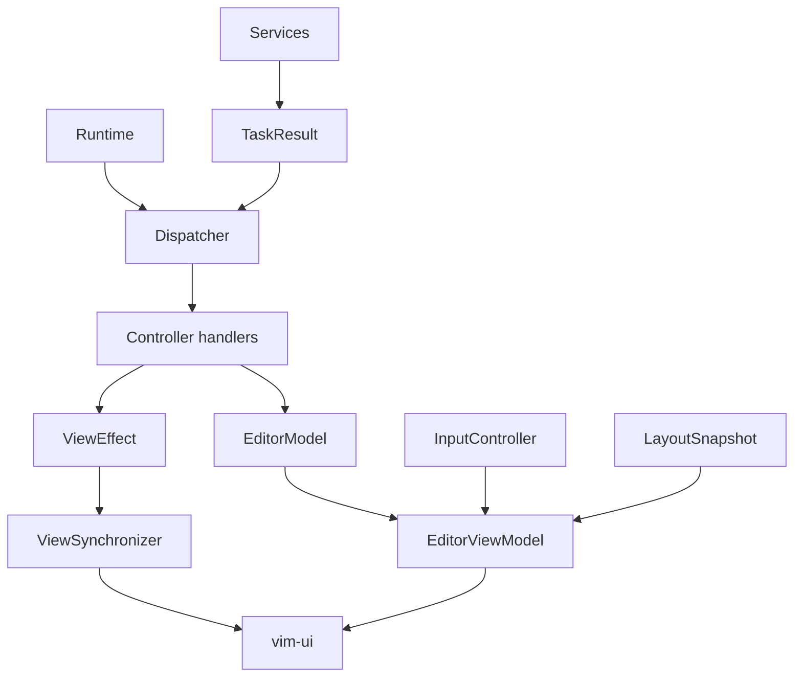

# nxvim Architecture

`nxvim` uses an MVC-oriented architecture with an explicit runtime and composition root.



## Module responsibilities

### `src/model`

Owns semantic editor state:

- `EditorModel`
- `Buffers` and per-buffer `BufferState`
- `Windows` and per-window `WindowState`
- buffer/window lifecycle and editor-state invariants

The model must not import terminal input, rendering, UI layout, controller handlers, or service implementations. Callers mutate state through explicit `EditorModel` operations such as `edit_window`, buffer switching, focus, and split registration.

### `src/controller`

Normalizes commands, executes editor behavior, and accepts typed background results. Controllers may mutate the model and emit `ViewEffect`s, but do not render or manipulate terminal state directly.

### `src/view`

Builds the immutable `EditorViewModel` from `EditorModel`, input mode, and `LayoutSnapshot`. View rendering consumes this projection through `vim_ui::UIContext`; it does not mutate editor state.

### `src/app`

Contains the small application composition root and infrastructure adapters:

- input resolver;
- script runtime;
- background services;
- editor operation implementation;
- concrete UI setup and `ViewSynchronizer`.

`ViewSynchronizer` is the single application path for focus, split, close/hide, and resize effects. It keeps semantic model windows synchronized with concrete `vim_ui` windows.

### `src/runtime.rs`

Owns terminal lifecycle. It polls events and tasks, dispatches commands, applies view effects, builds the view model, renders, and flushes output.

## Window identity

`ViewIds` records concrete UI identities. The main editor and command-line windows are semantic windows registered in `EditorModel`. Tabline, statusline, and side panels are UI-only chrome and never participate in model window navigation.

## Dependency guard

Run:

```sh
scripts/check-architecture.sh
```

The script rejects forbidden model imports of terminal, renderer, view, controller, or service implementation modules.
