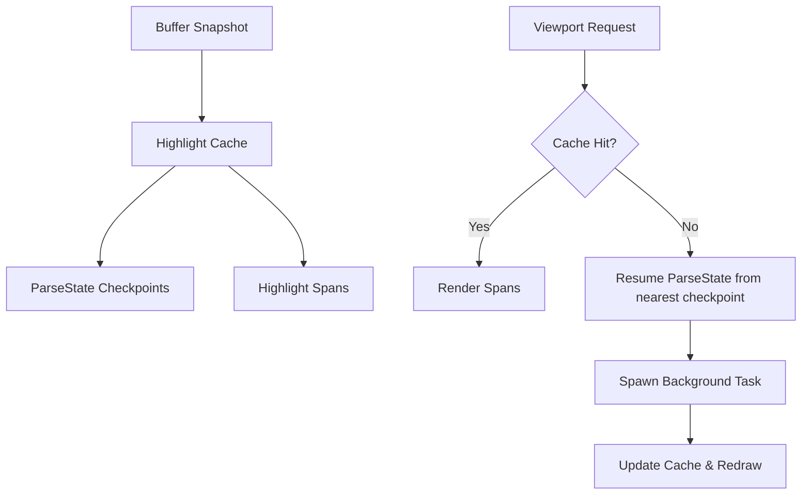

# TextMate Highlight Refactoring Design

This document outlines the design for the next iteration of the `textmate` crate. The goal is to support **windowed highlighting** that resolves quickly, expands asynchronously via background tasks, and utilizes an $O(\log N)$ cache mapped via `Anchor`s to store both syntect `ParseState` checkpoints and computed `HighlightSpan`s.

---

## 1. Core Architecture

The highlighting system is split into a **synchronous query layer** (runs on the main thread for instant rendering) and an **asynchronous parser worker** (runs in the background to handle long-range parsing).



### 1.1. ParseState Checkpoints (Cache)
To highlight a window without parsing from the beginning of the file, we cache the syntect `ParseState` and `ScopeStack` at the beginning of periodic intervals (e.g., every 64 lines).

```rust
pub struct ParseStateCheckpoint {
    /// The location in the buffer where this parse state is valid (start of a line).
    pub anchor: Anchor,
    /// The cached raw byte offset corresponding to the anchor in the current snapshot version.
    pub cached_offset: usize,
    /// The parser state representing the syntect stack at the start of this line.
    pub parse_state: syntect::parsing::ParseState,
    /// The ScopeStack at the start of this line.
    pub scope_stack: syntect::parsing::ScopeStack,
}
```

These checkpoints are stored in a `Vec<ParseStateCheckpoint>` sorted by their resolved byte offsets.

### 1.2. Highlight Span Chunks (Cache)
Highlight spans are grouped into non-overlapping contiguous chunks of lines:

```rust
pub struct CachedHighlightChunk {
    /// The starting boundary of this chunk.
    pub start: Anchor,
    /// The ending boundary of this chunk.
    pub end: Anchor,
    /// The cached raw starting byte offset in the current snapshot.
    pub cached_start_offset: usize,
    /// The cached raw ending byte offset in the current snapshot.
    pub cached_end_offset: usize,
    /// The flat list of highlight spans inside this chunk.
    pub spans: Vec<HighlightSpan>,
}
```

These chunks are stored in `style_cache: Vec<CachedHighlightChunk>` sorted by `cached_start_offset`.

---

## 2. Log(N) Cache Retrieval & Resolved Offset Caching

Because resolving an `Anchor` to a byte offset (`usize`) requires traversing the buffer's tree structure, performing this resolution repeatedly during binary search is expensive. To optimize this:

### 2.1. Caching Resolved Offsets
We store the resolved `usize` byte offsets (`cached_offset`, `cached_start_offset`, `cached_end_offset`) directly in the cache entries.
- These offsets are valid for the **current snapshot version** (`changedtick`).
- When a query is performed against a snapshot of the same version, we binary search directly on the pre-resolved integer offsets. This turns the lookup into a pure integer binary search, which has zero tree-traversal overhead.

### 2.2. Re-resolution on Version Changes
When a query is made against a *new* buffer snapshot version:
1. We iterate through the active cache entries and re-resolve their `Anchor`s using the new snapshot.
2. We update the cached `usize` offsets with the newly resolved values.
3. We re-sort the cache arrays if any edits caused the relative order of anchors to shift (though anchors generally maintain monotonic ordering).
4. The version of the cache is updated to match the new snapshot version.

This ensures that subsequent queries on the same snapshot version remain $O(\log N)$ with maximum cache locality and minimal CPU overhead.

---

## 3. Asynchronous Windowed Expansion

When the viewport changes:
1. The viewport boundaries are mapped to `start` and `end` `Anchor`s.
2. The cache is queried for spans. If there are gaps:
   - Find the nearest `ParseStateCheckpoint` prior to the gap start ($O(\log N)$ using the cached offsets).
   - If no checkpoint exists, start from the beginning of the file.
3. Spawn a background task to parse from the checkpoint through the gap:
   - The task processes line-by-line.
   - It records new `HighlightSpan`s and periodically records new checkpoints.
   - When the gap is filled, the task merges the new chunks and checkpoints into the cache, resolves their offsets, and requests a redraw.

---

## 4. Invalidation & State Convergence (Settling)

When the user edits the buffer at anchor `A`:

### 4.1. Immediate Invalidation
Any edits invalidate the parse state downstream because syntaxes are context-sensitive (e.g. typing `/*` changes everything following it to a comment).
1. We discard all `ParseStateCheckpoint`s whose anchors are greater than or equal to `A`.
2. We discard all `CachedHighlightChunk`s whose ranges overlap with or start after `A`.

### 4.2. State Convergence (Optimized Settling)
To avoid re-parsing the entire document on every edit, the background task utilizes **state convergence**:
- The task begins parsing from the nearest valid checkpoint before `A`.
- As it parses past the edited region and enters unchanged text, it compares its current `ParseState` (and `ScopeStack`) at line boundaries with the pre-existing checkpoints that were saved before the edit.
- If the new `ParseState` at a checkpoint's anchor **matches** the pre-existing `ParseState`, **the parser has converged**.
- The task can safely stop parsing and preserve all subsequent checkpoints and highlight chunks, avoiding unnecessary work for the rest of the file.
