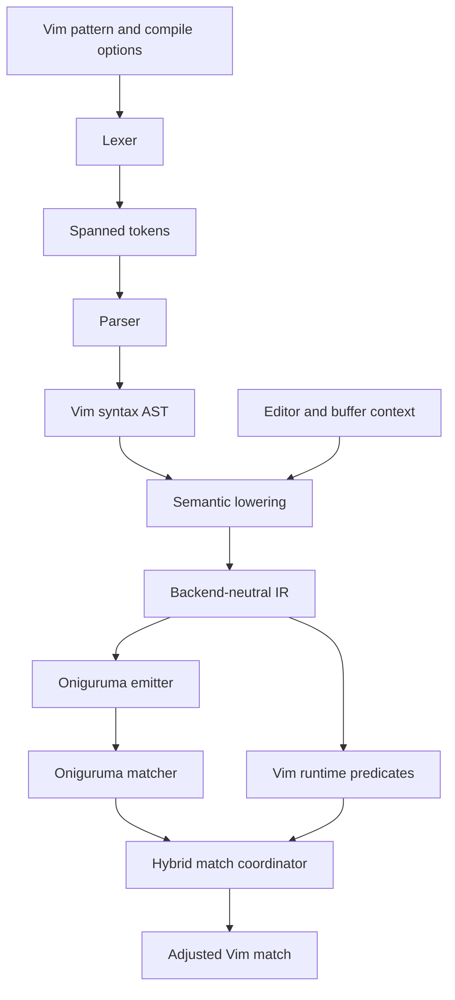

# vim-regex

A Rust translation and compatibility layer that accepts Vim regular-expression syntax and executes the translatable portion with Oniguruma.

> Status: The public parse → lower → match pipeline passes every declared Tier A, Tier B, and Tier C fixture, including position, cursor, visual-area, match-boundary, and composing-character behavior.

## Usage

Compile a Vim pattern and retrieve its adjusted byte range and Vim-numbered captures:

```rust,ignore
use vim_regex::{CompileOptions, Regex};

let text = "λ abxyzc";
let regex = Regex::compile(r"\v%(ab(xyz)c)", CompileOptions::default())?;
let found = regex.find(text)?.expect("pattern should match");

assert_eq!(found.range, 3..9);
assert_eq!(found.captures[1], Some(5..8));
assert_eq!(&text[found.range], "abxyzc");
```

Assertions that depend on buffer or editor state use an explicit `MatchContext`:

```rust,ignore
use vim_regex::{BufferContext, CompileOptions, Regex};

let context = BufferContext::new("word\nword").with_cursor(5);
let regex = Regex::compile(r"\%2l\%#word", CompileOptions::default())?;
let found = regex
    .find_in_context(&context)?
    .expect("pattern should match on line two at the cursor");

assert_eq!(found.range, 5..9);
```

Run `cargo run` in this repository for a broader executable showcase, including `\zs`/`\ze`, syntax-region external captures, and structured diagnostics.

## Current compatibility

**30 of 30 fixtures pass end-to-end: 100%.** This rating uses the declared corpus in [`fixtures/corpus-v1.json`](fixtures/corpus-v1.json) against the pinned **Vim 9.2.0843** oracle on Linux with UTF-8 and multibyte support.

| Compatibility tier | Passing | Rate |
|---|---:|---:|
| Tier A — native translation | 14/14 | 100% |
| Tier B — options and multiline behavior | 7/7 | 100% |
| Tier C — hybrid/editor context | 9/9 | 100% |
| **Overall declared A–C corpus** | **30/30** | **100%** |

Tier D is reported separately because these cases verify deliberate, structured rejection rather than Vim-equivalent matching:

| Deferred syntax corpus | Verified diagnostics | Rate |
|---|---:|---:|
| Tier D — explicit unsupported behavior | 4/4 | 100% |

The Tier C fixtures cover line, byte-column, virtual-column, cursor, and visual-area assertions plus `\zs`, `\ze`, `\Z`, and `\%C`, including exact adjusted byte ranges and capture zero. The separate Tier D corpus covers equivalence classes and Vim engine-selection atoms, requiring exact `Unsupported` diagnostic kind, phase, span, and message category. See [`COMPATIBILITY.md`](COMPATIBILITY.md) for environment details and documented limitations.

### External syntax captures: two-stage limitation

Vim uses external captures across two separate syntax-region patterns: a start pattern records `\z(...)`, and a later end pattern refers to that text with `\z1`–`\z9`. This crate models that flow explicitly rather than treating external captures as ordinary same-pattern backreferences:

```rust,ignore
let start_text = "BEGIN tag";
let start = vim_regex::Regex::compile(
    r"BEGIN \z(tag\)",
    vim_regex::CompileOptions::default(),
)?;
let start_match = start.find(start_text)?.expect("start pattern should match");

let captured = start_match.external_captures[1]
    .clone()
    .map(|range| start_text[range].to_owned());
let end = vim_regex::Regex::compile_with_external_captures(
    r"END \z1",
    vim_regex::CompileOptions::default(),
    [captured],
)?;
```

External capture ranges are stored separately from ordinary Vim captures, so `\z(...)` does not change `\1`–`\9` numbering. An end pattern containing `\zN` fails with a structured `MissingContext` diagnostic when capture `N` is not supplied.

The current fixture/oracle protocol executes one pattern per fixture and cannot represent this start-match → capture transfer → end-pattern sequence. External captures are therefore covered by parser, lowering, backend, and public API tests, but are **not represented in the 30-fixture compatibility percentage**. A future fixture-schema revision should add a two-stage syntax-region record before this behavior is included in the differential percentage.

## Goals

- Reach **at least 90% compatibility** with documented Vim regular-expression syntax and interpretation.
- Parse Vim patterns independently of Oniguruma so syntax can be inspected, formatted, diagnosed, and transformed.
- Delegate ordinary regular-expression execution to Oniguruma rather than building another regex VM.
- Preserve Vim semantics that depend on editor state through explicit runtime predicates and match-boundary adjustments.
- Produce precise, span-based diagnostics for invalid or unsupported patterns.

## Non-goals (initially)

- Bit-for-bit compatibility with Vim's NFA and backtracking engines.
- Vim's replacement expression language (`:s`, `substitute()`, `\=`). It should become a separate parser after pattern matching is stable.
- Full syntax-highlighting command semantics such as `contains`, `nextgroup`, and `skipwhite`; only the regex constructs used by syntax rules are in scope.
- Reproducing unspecified engine behavior, pathological backtracking, or historical bugs.

## Authoritative references

Vim's implementation and tests take precedence over prose when they disagree.

| Priority | Source | Location |
|---|---|---|
| 1 | Pattern specification | Vim `runtime/doc/pattern.txt` ([online](https://vimhelp.org/pattern.txt.html)) |
| 2 | Engine tests | Vim `src/testdir/test_regexp_*.vim` |
| 3 | Engine implementation | Vim `src/regexp.c`, `src/regexp_bt.c`, `src/regexp_nfa.c` |
| 4 | User tutorial | Vim `runtime/doc/usr_27.txt` |
| 5 | Option semantics | Vim `runtime/doc/options.txt` |
| 6 | Call-site behavior | Vim `src/search.c`, `src/ex_cmds.c`, `src/syntax.c`, `src/searchpair.c` |
| 7 | Function behavior | Vim `runtime/doc/builtin.txt`, `runtime/doc/eval.txt` |
| 8 | Substitution behavior | Vim `runtime/doc/change.txt` |

Compatibility tests identify the Vim version used as their oracle. The conformance target is pinned to Vim 9.2.0843; behavior changes between Vim versions must be recorded as fixtures rather than guessed.

## Architecture



### 1. Lexer

The lexer tracks the active magic mode (`\v`, `\m`, `\M`, `\V`) while preserving source spans. Whether a character is literal or special is decided here, not by emitting escaping directly. Collections require their own lexical state.

### 2. Parser and AST

The parser models Vim syntax faithfully: branches, concatenation, groups, postfix quantifiers, lookarounds, backreferences, character classes, and position atoms. The AST retains distinctions that may emit similarly but have different Vim semantics. It is public so clients can use the crate for syntax interpretation without compiling a matcher.

### 3. Semantic lowering

Lowering resolves options and converts the syntax AST into a smaller backend-neutral IR. It must:

- expand option-dependent classes such as `\k` using `iskeyword`;
- determine effective case sensitivity from `ignorecase`, `smartcase`, `\c`, and `\C`;
- separate Oniguruma-compatible expressions from editor-state predicates;
- represent `\zs` and `\ze` as match-boundary markers;
- reject valid-but-not-yet-supported features separately from malformed syntax.

### 4. Oniguruma emitter

The emitter is the only module that knows Oniguruma syntax and crate APIs. It emits a backend pattern plus a capture map, preventing backend-only captures from changing Vim capture numbering. All generated fragments must be escaped by construction.

### 5. Hybrid matcher

Some atoms cannot be represented by a string-only regex engine:

- line, byte-column, and virtual-column assertions (`\%23l`, `\%23c`, `\%23v`);
- cursor and visual-area assertions (`\%#`, `\%V`);
- match boundary changes (`\zs`, `\ze`);
- composing-character behavior (`\Z`, `\%C`);
- classes derived from editor options.

The initial hybrid strategy is **candidate generation plus validation**: Oniguruma finds candidates and the coordinator validates predicates against `MatchContext`, then adjusts the reported range. Lowering must retain enough information to add a more integrated matcher if candidate validation proves semantically insufficient.

## Core data model

The crate architecture mirrors the pipeline:

| Module | Responsibility |
|---|---|
| `ast` | Lossless-enough Vim regex syntax tree and source spans |
| `context` | Compile options and editor/buffer state required at match time |
| `ir` | Normalized expressions, runtime predicates, and boundary markers |
| `compiler` | Phase-independent diagnostics and compiled translation plans |

The public API exposes parsing, lowering, and compilation entry points:

```rust,ignore
let ast = vim_regex::parse(r"\v(foo|bar)+")?;
let plan = vim_regex::lower(&ast, &compile_options)?;
let regex = vim_regex::Regex::compile(r"\<word\>", compile_options)?;
```

Parsing must not require editor state. Compilation may require options, while matching receives buffer-specific `MatchContext`.

## Compatibility strategy

Compatibility is measured by behavior, not by the percentage of tokens recognized.

### Tier A — native translation

Expected to map directly or with local rewriting:

- literals, concatenation, alternation, captures, and non-capturing groups;
- ordinary collections and character classes;
- greedy and non-greedy quantifiers;
- anchors, lookahead, lookbehind, and backreferences;
- case overrides and common Unicode behavior.

### Tier B — translated with context

Requires compile options or generated classes:

- all four magic modes;
- `iskeyword`/filename/printable classes (`\k`, `\f`, `\p` and negations);
- word boundaries using Vim's keyword definition;
- multi-line atoms (`\_.`, `\_s`, `\_[]`, `\n`);
- `ignorecase` and `smartcase` interactions.

### Tier C — hybrid evaluation

Requires match-time buffer/editor state:

- `\zs`, `\ze`;
- `\%l`, `\%c`, `\%v`, `\%#`, `\%V`;
- optional-tail groups (`\%[]`) if they cannot be emitted without semantic drift;
- syntax-region external captures (`\z(` and `\z1`-`\z9`).

### Tier D — deferred or explicitly unsupported

- equivalence classes where Vim/Unicode tables cannot be reproduced reliably;
- engine-selection flags whose only purpose is choosing Vim's internal engine;
- behavior dependent on unavailable UI state;
- replacement expressions and Ex command parsing.

Every Tier D construct must produce an `Unsupported` diagnostic, never silently change meaning.

[`fixtures/syntax-tier-d-v1.json`](fixtures/syntax-tier-d-v1.json) is a curated syntax-only import from Vim 9.2.0843's `test_regexp_latin.vim` and `test_regexp_utf8.vim`. It currently covers equivalence classes and both explicit engine-selection atoms. These diagnostic fixtures are tested separately and are not part of the 30-fixture A–C compatibility denominator.

## Feature inventory

The conformance suite must cover:

- **Magic:** default magic plus `\v`, `\m`, `\M`, `\V`, including mode changes mid-pattern.
- **Quantifiers:** `*`, `\+`, `\=`, `\?`, `\{m,n}`, and minimal `\{-m,n}` forms.
- **Zero-width:** `^`, `$`, `\<`, `\>`, all four `\@` lookarounds, `\%^`, and `\%$`.
- **Groups:** captures, `\%()`, alternation, optional-tail `\%[]`, and external syntax captures.
- **Classes:** Vim built-ins (`\a`, `\d`, `\x`, `\o`, `\h`, `\l`, `\u`, `\w`, `\k`, `\f`, `\p`) and negations.
- **Collections:** ranges, negation, literal `]`/`-`/`^`, POSIX classes, composing characters.
- **Multiline:** newline atoms and underscore-prefixed classes.
- **Positions:** line, column, virtual column, cursor, visual area, start/end of file.
- **Matching controls:** `\c`, `\C`, `\zs`, `\ze`, `\Z`, and engine-selection atoms.
- **Encoding:** UTF-8 code points, combining marks, invalid boundaries, and byte-vs-character columns.

`tests/ast_snapshots.rs` keeps one parse-outcome snapshot for every family above. Implemented syntax snapshots its complete spanned AST; syntax awaiting parser support snapshots its structured `Unsupported` diagnostic so it cannot be silently reinterpreted.

## Implementation plan

### Phase 0 — specification harness

1. Pin a Vim oracle version in CI.
2. Import or adapt representative cases from `test_regexp_*.vim`.
3. Define fixture records containing pattern, text/buffer, options, expected captures, and expected diagnostics.
4. Categorize fixtures by compatibility tier and feature tag.

**Exit criterion:** fixtures can be executed against Vim and serialized for Rust tests.

### Phase 1 — syntax interpretation

1. Implement spanned lexer states and magic-mode transitions.
2. Implement precedence-aware parsing into `ast::Expr`.
3. Add stable diagnostics with source ranges.
4. Add AST snapshot tests for every syntax family.

**Exit criterion:** at least 95% of documented pattern forms parse correctly; unsupported semantic features still have valid AST nodes.

### Phase 2 — direct Oniguruma backend

1. Add the Oniguruma dependency behind a default backend feature.
2. Lower Tier A nodes into `ir::Expr`.
3. Emit backend patterns with an explicit capture-number map.
4. Compare matches and captures against Vim fixtures.

**Exit criterion:** Tier A fixtures agree with Vim, including capture ranges.

### Phase 3 — Vim options and multiline behavior

1. Parse option character-set specifications such as `iskeyword`.
2. Resolve case behavior and option-dependent classes.
3. Define buffer line-ending representation and byte/character offsets.
4. Complete Tier B lowering and tests.

**Exit criterion:** Tier A and B fixtures agree under a matrix of relevant options.

### Phase 4 — hybrid semantics

1. Implement `MatchContext` adapters and candidate validation.
2. Implement position predicates and visual/cursor assertions.
3. Implement match-boundary adjustment and external captures.
4. Detect cases where post-validation cannot preserve Vim behavior and add a constrained fallback.

**Exit criterion:** Tier C fixtures agree and all required context is explicit in the API.

### Phase 5 — compatibility and hardening

1. Differential-test generated patterns against Vim.
2. Measure compatibility by feature-weighted fixtures and publish the report.
3. Fuzz lexer/parser/lowering; malformed input must never panic.
4. Add candidate, match, and memory limits to mitigate regex denial of service.
5. Document intentional incompatibilities and version differences.

**Exit criterion:** at least 90% of the declared conformance corpus passes, with no silent handling of unsupported constructs.

## Engineering constraints

- No compiler phase may panic on user patterns.
- All diagnostics carry a source span and phase.
- Byte offsets are the canonical internal coordinates; line, character, and virtual columns are derived through `MatchContext`.
- User capture numbers remain stable even if emission introduces internal captures.
- Compile-time options and match-time editor state remain separate.
- Unsupported behavior is explicit and machine-readable.
- Backend-specific details do not leak into the syntax AST.

## Testing

Use four layers:

1. **Unit tests:** lexer transitions, parser precedence, lowering rules, and escaping.
2. **Golden tests:** Vim pattern → AST/IR/emitted Oniguruma pattern.
3. **Differential tests:** same pattern and buffer run in Vim and this crate.
4. **Property/fuzz tests:** arbitrary UTF-8 and malformed patterns; no panics and valid spans.

A compatibility claim must name the fixture corpus, Vim version, platform assumptions, and pass rate. “90% compatible” without those dimensions is not actionable.

## Regression fixture milestone

The versioned fixture corpus, pinned Vim oracle, public pattern-string pipeline, exact range/capture comparisons, and per-tier conformance runners now provide the authoritative regression baseline. Remaining work should continue to add or update a fixture before changing parser, lowering, or matcher behavior.

1. **Define the fixture schema**
   - [x] Store the Vim pattern and input text or multiline buffer.
   - [x] Store relevant options such as `magic`, `ignorecase`, `smartcase`, and `iskeyword`.
   - [x] Store cursor, visual range, tab stop, and other required editor state.
   - [x] Store expected match byte range, capture ranges, or expected diagnostic.
   - [x] Add feature tags and a compatibility tier to every fixture.
   - [x] Version the schema so fixtures remain readable as fields are added.

2. **Build and pin the Vim oracle**
   - [x] Pin the Vim version used by CI.
   - [x] Record Vim build features, platform assumptions, and relevant default options.
   - [x] Implement a non-interactive Vim script that executes one fixture deterministically.
   - [x] Serialize oracle results without relying on localized human-readable messages.
   - [x] Add clear handling for missing Vim, timeouts, crashes, and unsupported fixtures.

3. **Create the fixture workflow**
   - [x] Add a command to generate or refresh expected results from the pinned Vim oracle.
   - [x] Add a separate command that verifies checked-in results without rewriting them.
   - [x] Keep fixture updates reviewable and deterministic.
   - [x] Require an explicit refresh action when expected Vim behavior changes.

4. **Seed a representative corpus**
   - [x] Add literals, escaping, and all four magic modes.
   - [x] Add branches, captures, non-capturing groups, and backreferences.
   - [x] Add greedy, minimal, bounded, and invalid quantifiers.
   - [x] Add collections, ranges, POSIX classes, and malformed collections.
   - [x] Add `ignorecase`, `smartcase`, `\c`, `\C`, and option-dependent classes.
   - [x] Add multiline patterns and UTF-8 byte-boundary cases.
   - [x] Add `\zs`, `\ze`, line/column assertions, cursor, and visual-area cases.
   - [x] Adapt representative cases from Vim's `src/testdir/test_regexp_*.vim` tests and retain source attribution.

5. **Connect fixtures to Rust tests**
   - [x] Load and validate every fixture with useful schema diagnostics.
   - [x] Run syntax fixtures through the public pattern-string API once the parser exists.
   - [x] Compare exact byte ranges and every capture, not only matched text.
   - [x] Compare structured diagnostic categories separately from unstable message wording.
   - [x] Report pass, fail, unsupported, and excluded counts by feature and tier.

6. **Establish the regression policy**
   - [x] Every parser, lowering, or matcher bug fix adds a reproducing fixture first.
   - [x] CI verifies checked-in fixtures and never silently refreshes expectations.
   - [x] Unsupported behavior remains in the report and is never treated as a passing match.
   - [x] Compatibility percentages name the fixture corpus and pinned Vim version.
   - [x] Do not claim 90% compatibility until the public pattern-string pipeline runs the declared corpus.

## Step-by-step implementation checklist

Work through this list in order. Check an item only when its tests and documentation are complete.

- [x] Pin the target Vim version and record its build/options.
- [x] Create the Vim oracle fixture format and test runner.
- [x] Import representative fixtures from Vim's regex tests.
- [x] Implement source spans, tokens, and lexer diagnostics.
- [x] Implement all four magic modes and mid-pattern mode switches.
- [x] Implement collections and escaped-character lexing.
- [x] Implement parser precedence, branches, concatenation, and groups.
- [x] Implement quantifiers, lookarounds, anchors, and backreferences.
- [x] Parse Vim-only atoms without silently changing their meaning.
- [x] Add AST snapshots for every documented syntax family.
- [x] Lower Tier A syntax into the backend-neutral IR.
- [x] Add Oniguruma and implement safe pattern emission.
- [x] Preserve Vim capture numbering with an explicit capture map.
- [x] Match Tier A fixtures against the Vim oracle.
- [x] Implement case options and option-dependent character classes.
  - [x] Parse Vim character-option sets and ordered exclusions.
  - [x] Resolve `ignorecase`, `smartcase`, `\c`, and `\C` inputs.
  - [x] Connect resolved option classes to AST-to-IR lowering.
- [x] Implement multiline matching and buffer offset conventions.
  - [x] Define UTF-8 byte, line, and virtual-column behavior.
  - [x] Implement tab stops and Unicode display widths.
  - [x] Connect multiline atoms through parsing, lowering, and matching.
- [x] Match Tier B fixtures against the Vim oracle.
- [x] Implement `MatchContext` and candidate validation.
- [x] Implement position, cursor, and visual-area assertions.
- [x] Implement `\zs`, `\ze`, composing behavior, and external captures.
  - [x] Record and apply `\zs` and `\ze` boundary markers.
  - [x] Preserve Vim captures when internal marker captures are emitted.
  - [x] Implement composing-character behavior.
  - [x] Implement syntax-region external captures.
- [x] Match Tier C fixtures against the Vim oracle.
- [x] Add property-based fuzzing, resource limits, and malformed-pattern tests.
- [x] Publish the compatibility matrix and documented exclusions.
- [x] Reach and verify at least 90% of the declared conformance corpus.
