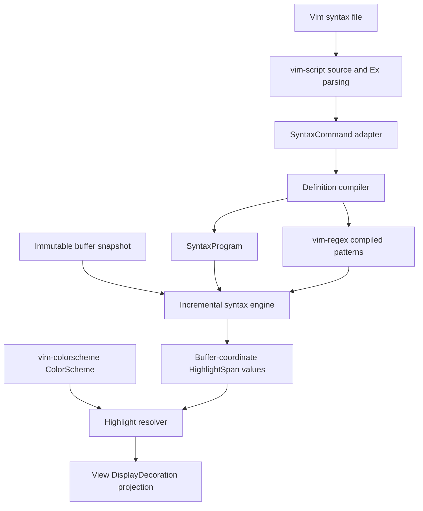

# `vim-syntax` design

## Status and scope

`vim-syntax` will implement Vim's regex-driven `:syntax` highlighting model for nxvim. It is a syntax engine, not a renderer: it consumes syntax definitions and immutable buffer text, and emits styled byte ranges in buffer coordinates. The view layer projects those ranges through `DisplayMap` and renders them as `DisplayDecoration`s.

The initial target is the commonly used Vim syntax-file surface:

- `:syntax match`, `region`, `keyword`, `cluster`, `include`, `clear`, `sync`, `case`, and `spell`.
- `contains=`, `contained`, `containedin=`, `nextgroup=`, `skipwhite`, `skipnl`, `skipempty`, `transparent`, `display`, `extend`, `keepend`, `oneline`, and `excludenl`.
- `matchgroup=`, `start=`, `skip=`, `end=`, `hs/he/ms/me/rs/re/lc` offsets, and region `\z(...)`/`\z1` captures.
- Vim highlight groups and `:highlight link` resolution.
- Incremental recomputation with synchronization points.

Exact Vim behavior is preferred over accepting every command. Unsupported arguments must produce diagnostics rather than silently changing semantics.

## Architectural boundary



The crate must not depend on `vim-ui`, `display_map`, or nxvim's kernel. This keeps syntax evaluation reusable and prevents display wrapping, folds, scrolling, and terminal columns from leaking into matching semantics.

## Reuse of existing crates

### `vim-regex`

All syntax patterns are compiled with `vim_regex::Regex`; no second regex dialect is introduced. `Regex::compile_with_external_captures` supplies a region end pattern with captures from its start match. Compile options are built from syntax case mode and relevant editor options (`ignorecase`, `iskeyword`, magic behavior). The engine needs a cursor-based matching API that finds at or after a byte offset; if `vim-regex` does not expose one, add that API there rather than repeatedly slicing text, because slicing changes line/buffer anchors and positional atoms.

### `vim-colorscheme`

`vim_colorscheme::ColorScheme` and `Style` are the canonical style registry and value type. Syntax definitions retain group names, not copied styles. Resolving names at query time makes colorscheme changes cheap and preserves highlight links. Missing groups resolve to `Style::default()` and emit at most one diagnostic per group/program generation.

The scheme currently stores final styles but not links. Link ownership should therefore live in `HighlightLinks` in this crate until `vim-colorscheme` gains a shared highlight registry. Resolution follows links with cycle detection and a bounded depth.

### `vim-script`

`vim-script` remains responsible for sourcing files, conditionals, variables, functions, and generic Ex parsing. A `SyntaxCommandHandler` receives preserved Ex command text and mutates a `SyntaxBuilder`. This avoids duplicating Vimscript evaluation in `vim-syntax`.

The preferred long-term integration is a command-provider extension point in `vim-script::host::Host`. The provider registers `syntax`/`syn`, `highlight`/`hi`, and syntax-aware `runtime!`/`source` handling. Includes are loaded through the host's runtime-path resolver, never directly through ambient filesystem access.

## Public API

The first implementation should expose an API equivalent to:

```rust
pub struct SyntaxBuilder { /* definitions, links, options, diagnostics */ }
pub struct SyntaxProgram { /* immutable compiled definitions and indexes */ }
pub struct SyntaxState { /* line checkpoints and cached spans */ }

pub struct SyntaxOptions {
    pub case: SyntaxCase,
    pub is_keyword: String,
    pub max_bytes_per_pass: usize,
    pub max_transitions_per_line: usize,
    pub max_region_depth: usize,
}

pub struct TextEdit {
    pub old_range: std::ops::Range<usize>,
    pub new_range: std::ops::Range<usize>,
}

pub struct HighlightSpan {
    pub range: std::ops::Range<usize>,
    pub group: GroupId,
    pub priority: u32,
}

impl SyntaxBuilder {
    pub fn execute(&mut self, command: SyntaxCommand) -> Result<(), SyntaxError>;
    pub fn finish(self) -> Result<SyntaxProgram, Vec<Diagnostic>>;
}

impl SyntaxState {
    pub fn new(program: std::sync::Arc<SyntaxProgram>) -> Self;
    pub fn update(&mut self, text: &str, edit: Option<&TextEdit>) -> UpdateResult;
    pub fn spans(&self, byte_range: std::ops::Range<usize>) -> impl Iterator<Item = &HighlightSpan>;
}

pub fn resolve_spans(
    spans: impl IntoIterator<Item = HighlightSpan>,
    program: &SyntaxProgram,
    scheme: &vim_colorscheme::ColorScheme,
) -> Vec<StyledSpan>;
```

Offsets are UTF-8 byte offsets. Ranges are half-open. Public identifiers (`GroupId`, `PatternId`, `ClusterId`) are typed newtypes. `SyntaxProgram` is immutable and shareable across buffers using the same filetype and effective syntax settings; `SyntaxState` is buffer-local.

## Definition model

`SyntaxProgram` stores definitions in command order because Vim tie-breaking depends on recency and position. It also stores indexes by group, first literal/keyword byte where possible, containment relation, and cluster expansion.

- `Keyword`: normalized keyword plus optional conceal character and common flags. Matching obeys `iskeyword`; a trie avoids one regex per keyword.
- `Match`: one compiled Vim regex and match offsets.
- `Region`: ordered start/skip/end patterns, match groups, offsets, and region flags. Each active region frame carries start captures so end patterns can be compiled or cached by capture tuple.
- `Cluster`: named set of groups, clusters, and special selectors such as `ALL`, `ALLBUT`, `TOP`, and `CONTAINED`.
- `HighlightLinks`: group-to-group aliases from `:highlight link`.

Cluster references are expanded at `finish()` when possible. Cycles are diagnosed and represented safely as empty recursive edges. Definitions added after a referenced cluster require either finalization after sourcing or generation-based re-expansion; the initial implementation finalizes only after the syntax file is fully sourced.

## Command parsing

Use `vim-script` to preserve command boundaries, quoting, bars, and source spans. `vim-syntax` parses only the argument grammar specific to `:syntax` and `:highlight`.

Pattern delimiters are arbitrary non-alphanumeric, non-backslash, non-quote bytes as in Vim. The parser must retain the pattern exactly after removing delimiters; it must not reinterpret regex escapes. Comma-separated group lists need escaped-comma handling. Every diagnostic includes the Vimscript source span supplied by `vim-script`, the subcommand, and the offending option.

Parsing and compilation are separate phases so syntax files can refer forward to groups/clusters and diagnostics can aggregate.

## Matching algorithm

Evaluation is a deterministic left-to-right state machine over buffer text.

1. Restore the nearest valid line checkpoint before the requested range.
2. At the current byte, collect eligible region-end/skip, contained, top-level match, region-start, and keyword candidates.
3. Choose the earliest start. At the same start, apply Vim precedence: active region boundaries first where required, then later-defined syntax items; keywords beat matches only where Vim does so. Encode this ordering in one documented comparator and oracle-test it.
4. Emit the winning item's highlight range, apply `matchgroup`, and push/pop region frames.
5. Apply `nextgroup` eligibility and `skipwhite`/`skipnl`/`skipempty` before normal candidates.
6. Guarantee progress by advancing one Unicode scalar after a zero-width transition; cap transitions and nesting.

Containment is checked against the active region and effective cluster sets. `transparent` inherits the containing group while still changing eligibility. `keepend`, `extend`, `oneline`, and `excludenl` alter region boundary selection, not post-processing of emitted spans.

Overlapping output spans are allowed internally. Before exposing styled spans, normalize them into non-overlapping segments using syntax precedence. Rendering priority remains available for composition with non-syntax decorations.

## Incremental state and synchronization

A line checkpoint contains:

- line start byte and a hash/version of the input prefix dependency;
- active region stack (pattern IDs, captures, flags, and effective group);
- pending `nextgroup` state;
- whether the state is a trusted sync anchor.

After an edit, invalidate the first touched line and all later checkpoints. Restart from the nearest earlier trusted checkpoint, or from a bounded `:syntax sync minlines/maxlines` scan. Recompute forward until both the produced line spans and outgoing checkpoint equal their cached values; subsequent lines can then be retained.

Supported synchronization strategy order:

1. explicit `grouphere`/`groupthere` sync matches;
2. comment synchronization (`ccomment`) when configured;
3. backward `minlines` scan;
4. start-of-buffer fallback for correctness.

`UpdateResult` reports changed byte ranges, incomplete/budget-exhausted status, and diagnostics. Budget exhaustion never publishes guessed state: retain old spans outside invalidated text and schedule continuation through nxvim's background worker. Program generations invalidate all checkpoints.

## Rendering integration

`src/view/mod.rs` currently creates `DisplayDecoration`s for selection (priority 100), search (50), and cursorline (10). Syntax should use a lower composition priority than search and selection and higher than a bare row background; reserve priority 20 for syntax initially.

Integration steps:

1. Store one `SyntaxState` per buffer, not per window, alongside buffer edit/version state.
2. Update it from buffer edits, preferably off the render hot path.
3. During model rebuild, query spans intersecting the visible buffer rows plus any wrapped-row boundary context.
4. Resolve each group through the active `ColorScheme`.
5. Convert each span's byte endpoints to `text::Point`, then through `DisplayMapSnapshot::try_point_to_display_point`.
6. Clip to the viewport and push a `DisplayDecoration { style, priority: 20, .. }`.
7. Split ranges crossing folds or non-contiguous display mappings rather than assuming one pair of endpoints describes every visible cell.

The existing row `TextSpan`s remain default-styled. Decorations are the correct composition mechanism because search, selection, cursorline, and syntax can overlap and the renderer already orders them by priority. Syntax ranges must be generated for buffer text, never `line_text` from the display map, because that text may be wrapped or synthesized.

A small adapter should live in nxvim (not this crate):

```rust
fn syntax_decorations(
    state: &SyntaxState,
    program: &SyntaxProgram,
    scheme: &ColorScheme,
    display: &DisplayMapSnapshot,
    viewport: Range<u32>,
) -> Vec<DisplayDecoration>;
```

## Concurrency and ownership

`SyntaxProgram` is `Send + Sync` and shared through `Arc`. `SyntaxState` is replaced atomically by buffer version: a worker receives immutable text/program snapshots and returns `(buffer_id, buffer_version, update)`. The editor discards stale results. Rendering only reads a completed snapshot and never blocks on regex evaluation.

Compiled regexes and dynamically captured region-end regexes are cached. The dynamic cache is bounded by `(PatternId, capture tuple)` with LRU eviction to prevent untrusted files from growing memory without limit.

## Error handling and resource limits

Syntax files and buffer contents are untrusted inputs. Apply `vim-regex::ResourceLimits` during compilation and engine-level limits for definitions, cluster expansion, transitions per line, region depth, dynamic regex cache size, and bytes per update. No panic is permitted for malformed commands, invalid UTF-8 boundaries supplied by callers, cyclic links, empty matches, or unmatched regions.

Diagnostics are structured (`severity`, source span, command/pattern ID, message) and deduplicated where runtime repetition is likely. A failed individual definition is disabled; other definitions continue to work. A failed include preserves already compiled definitions and reports its include stack.

## Compatibility and testing

Testing has four layers:

1. parser unit tests for every command option, delimiter, escape, and diagnostic;
2. engine tests for precedence, containment, regions, offsets, captures, zero-width matches, and incremental/full equivalence;
3. colorscheme/link tests including missing groups and cycles;
4. Vim oracle fixtures.

Oracle fixtures run a pinned Vim in headless mode, source a syntax script, call `synID()`/`synIDattr()` for every byte position, and compare group runs with this crate. Keep the Vim version and fixture schema pinned similarly to `vim-regex`.

Property tests apply random edits and assert:

- incremental output equals a fresh full parse;
- spans are valid UTF-8 byte ranges within the buffer;
- normalized spans are ordered and non-overlapping;
- evaluation terminates under zero-width and recursive definitions.

Rendering adapter tests cover wrapping, horizontal scroll, folds, tabs, multibyte text, combining marks, and decoration priority against Search/Visual/CursorLine.

## Delivery plan

### Phase 1: useful core

- Command parser and builder for case, keyword, match, simple region, clear, and highlight links.
- Full-buffer evaluator using `vim-regex`.
- `ColorScheme` resolution and stable buffer-coordinate spans.
- Vim oracle fixtures for representative Rust/Vim syntax snippets.

### Phase 2: Vim containment

- Clusters, contained/containedin, nextgroup flags, transparent groups, matchgroup, skip patterns, region captures, and offsets.
- Central precedence comparator backed by oracle tests.

### Phase 3: incremental engine

- Line checkpoints, edit invalidation, convergence, sync commands, budgets, and background continuation.
- Differential tests between incremental and full evaluation.

### Phase 4: nxvim integration

- Buffer-owned syntax state and filetype/runtime syntax loading through `vim-script`.
- Visible-range conversion to `DisplayDecoration` at priority 20.
- Invalidation when text, filetype, syntax program, relevant options, or colorscheme changes.

### Phase 5: compatibility expansion

- Remaining conceal/spell/fold-related semantics and syntax-file corpus testing.
- Performance indexes and profiling based on real runtime syntax files.

## Explicit non-goals

- Tree-sitter/TextMate translation or mixing their capture semantics into Vim syntax rules.
- Rendering, terminal color quantization, folds, or display-column calculations inside this crate.
- Running an independent Vimscript interpreter.
- Silently approximating unsupported syntax options.
- Recomputing syntax synchronously during every frame.
