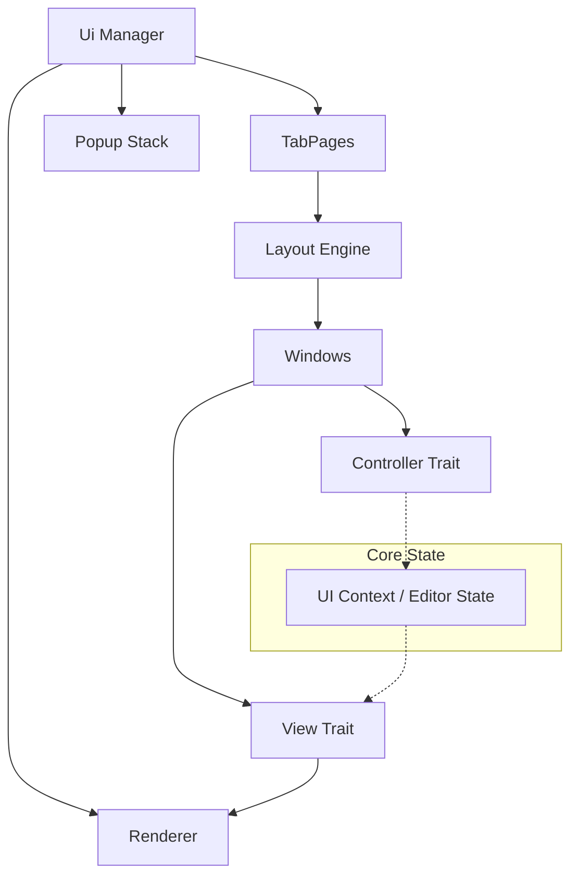

# vim-ui

A modular UI system for the `nxvim` editor, inspired by Vim's internal UI architecture but designed for modern extensibility.

## Core Architecture

The system is built around three main pillars: the Layout Engine, the Window System (MVC-ish), and the Rendering Pipeline.

### 1. Layout Engine
A recursive tree-based tiling engine that manages screen real estate.
- **Tiling Splits**: Supports `Horizontal` and `Vertical` splits using a `LayoutNode` tree.
- **Constraints**: Supports `Fixed` (rows/cols) and `Percentage` constraints.
- **Floating Windows**: A separate layer for "popups" or "floating windows" with Z-index management.
- **Navigation**: Built-in support for neighbor discovery (e.g., `ctrl-w h/j/k/l`).

### 2. Window System (Controller & View)
Every window on the screen is a container that pairs a `View` with an optional `Controller`.
- **Window**: The basic unit of the UI. Holds metadata like `id`, `rect`, `title`, and `is_focused`.
- **View (`trait View`)**: Responsible for rendering content into a given `Rect`.
  - *Example Views*: `EditorView` (for buffers), `StatusLineView`, `CommandLineView`, `TabLineView`, `PopupView`.
- **Controller (`trait Controller`)**: Responsible for handling events targeted at the window.
  - Decouples input handling from rendering.

### 3. Rendering Pipeline
A backend-agnostic rendering system.
- **Draw Context**: Passed to views during rendering, providing access to colorschemes, global state, and the renderer.
- **Renderer**: High-level API for drawing primitives (lines, text, borders, shadows).
- **Colorscheme**: Centralized management of highlight groups and ANSI/TrueColor mappings.

## Support for Vim Features
- [x] **Splits**: Recursive tiling.
- [ ] **Tabs**: Multiple layout trees (tab pages).
- [x] **Popups/Floating Windows**: Support for `nvim_open_win` style floating windows.
- [x] **Statusline**: Custom rendering for each window's status bar.
- [ ] **Command Line**: Dedicated area for input and messages.

## Implementation Plan

1.  **Stage 1: Foundation** [DONE]
    - Port `Rect`, `SplitDirection`, and `LayoutNode` from the current prototype.
    - Define core traits: `View`, `Controller`, `Renderer`.
    - Implement a basic `Crossterm` renderer.

2.  **Stage 2: Window Management** [DONE]
    - Implement the `Ui` manager to handle multiple windows and the focus stack.
    - Support for splitting and closing windows.

3.  **Stage 3: Specialized Views** [PARTIAL]
    - Implement `BufferView` with basic scrolling and line numbers.
    - Implement `StatusLine` rendering.

4.  **Stage 4: Floating Windows** [DONE]
    - Add a `popup_stack` to `Ui`.
    - Implement Z-index and relative positioning (relative to cursor or window).

## Detailed Architecture

### Component Diagram



### Flow of Control

1.  **Input Phase**: External events (keyboard, mouse, resize) are received by the main loop.
2.  **Dispatch Phase**: The `Ui` manager determines the target.
    - If a Popup is active and "modal", it gets the event.
    - Otherwise, the `focused_window`'s `Controller` receives the event.
3.  **Action Phase**: The `Controller` translates UI events into domain commands (e.g., `MoveCursor`, `InsertChar`, `SplitWindow`).
4.  **Update Phase**: The `Editor` state is updated.
5.  **Render Phase**:
    - `Ui` computes the layout tree to determine `Rect`s for each window.
    - `Ui` calls `window.draw(rect, context)`.
    - `window` calls `view.draw(rect, context)`.
    - `view` uses the `Renderer` to write to the screen.

---

## Architectural Ideas & Comments

### Decoupling Traits

To ensure `vim-ui` remains a standalone library, we should define the core traits inside this crate:

```rust
pub trait View {
    fn draw(&self, area: Rect, context: &dyn UIContext, renderer: &mut dyn Renderer);
}

pub trait Controller {
    fn handle_event(&mut self, event: Event, context: &mut dyn UIContext) -> bool;
}

pub trait UIContext {
    // Methods to access editor state without depending on the Editor struct
    fn get_buffer(&self, id: usize) -> Option<&dyn Buffer>;
    fn execute_command(&mut self, cmd: Command);
}
```

### Event Delegation
Events should flow from the main loop into the `Ui` manager, which delegates to the `focused_window`'s `Controller`. If the controller doesn't handle the event, it bubbles up to the global editor commands.

### Flexible Rendering

The `Renderer` should be a trait to allow for different backends and testing:

```rust
pub trait Renderer {
    fn move_to(&mut self, x: u16, y: u16);
    fn print(&mut self, text: &str);
    fn set_style(&mut self, style: Style);
    fn draw_rect(&mut self, rect: Rect, border: BorderStyle);
    // ...
}
```

This abstraction allows for:
- **Crossterm Backend**: For the standard TUI.
- **Test Backend**: To verify rendering output in unit tests.
- **GUI Backend**: Potential future use in a dedicated GUI window.

### Components vs Views
Consider a component-based approach for complex UI elements like the `StatusLine`, where users can configure segments (e.g., `[mode, file, position, git_branch]`).

---

## Refactoring Plan

The current implementation proves the main concepts, but several APIs are still prototype-level. The following stages strengthen the architecture before adding more editor features. Each stage should preserve a working showcase and add tests for its new invariants.

### Refactoring Stage 1: Strong IDs and Encapsulated State

**Goal:** Make invalid state harder to create and stop external code from mutating `Ui` internals directly.

Replace raw `usize` identifiers with dedicated newtypes:

```rust
pub struct WindowId(u64);
pub struct TabPageId(u64);
pub struct BufferId(u64);
```

Make `Ui` fields such as `windows`, `root_layout`, `focused_window_id`, and `screen_rect` private. Expose focused methods instead:

```rust
ui.window(id);
ui.window_mut(id);
ui.focus(id)?;
ui.set_layout(layout)?;
ui.screen_rect();
```

All mutations should preserve these invariants:

- Every tiled `WindowId` in a layout exists in the window store.
- A tiled window occurs at most once in a layout tree.
- The focused window exists, is visible, and belongs to the active tab page or overlay stack.
- Closing a window updates focus, layout caches, and associated UI state atomically.
- Floating windows cannot accidentally become tiled windows.

Add a crate-specific error type for operations that can fail, including unknown windows, invalid layouts, and attempts to close the final editor window.

**Completion criteria:** The showcase no longer modifies `Ui` fields directly, and layout/window consistency is covered by unit tests.

### Refactoring Stage 2: Separate Window Storage, Layout, and Focus

**Goal:** Prevent `Ui` from becoming a god object.

Extract the major responsibilities currently held by `Ui`:

- `WindowStore`: creates, retrieves, and removes windows.
- `LayoutEngine`: owns layout calculation and tree mutation.
- `FocusManager`: tracks current and previous focus and performs directional navigation.
- `OverlayManager`: owns floating windows, modal state, and Z-order.
- `Ui`: remains a small facade coordinating these components.

Layout calculation should produce a reusable result:

```rust
pub struct ComputedLayout {
    pub windows: Vec<(WindowId, Rect)>,
}
```

Directional navigation should consume `ComputedLayout` instead of reading mutable state from the renderer or manager. Layout terminology should also become unambiguous; prefer `SplitAxis::Columns` and `SplitAxis::Rows` over `Horizontal` and `Vertical` if those names continue to cause confusion.

**Completion criteria:** Layout, focus, window storage, and overlays can each be tested without constructing the complete UI.

### Refactoring Stage 3: Typed Events and Commands

**Goal:** Replace `Any` downcasting and boolean event results with explicit contracts.

Define UI events independently from Crossterm so the core remains backend-neutral:

```rust
pub enum UiEvent {
    Key(KeyEvent),
    Mouse(MouseEvent),
    Resize { width: u16, height: u16 },
    Paste(String),
    Tick,
}
```

Controllers should return a descriptive result rather than `bool`:

```rust
pub enum EventResult {
    Ignored,
    Consumed,
    Redraw,
    Command(UiCommand),
}
```

`UiCommand` should contain UI mutations such as focus movement, splitting, closing, opening an overlay, and switching tab pages. Editor commands should remain part of the editor/domain layer rather than being hidden inside UI types.

Establish event routing order:

1. Modal overlay.
2. Non-modal focused overlay.
3. Focused tiled window controller.
4. Tab-page controller.
5. Global editor key handling.

**Completion criteria:** Neither `Controller` nor event dispatch uses `dyn Any`, and input behavior can be tested without a terminal.

### Refactoring Stage 4: Explicit Editor Context and View Models

**Goal:** Give views the data they require without coupling `vim-ui` to the concrete editor or relying on runtime downcasting.

Replace `UIContext::as_any` with explicit read-only capabilities or immutable view models. A buffer window should receive a snapshot containing only render-relevant state:

```rust
pub struct BufferViewModel<'a> {
    pub lines: &'a dyn LineSource,
    pub cursor: BufferPosition,
    pub selections: &'a [Selection],
    pub mode: EditorMode,
}
```

Views should own presentation state such as scroll offsets, wrapping settings, and gutter configuration. The editor should continue to own documents, buffers, selections, and command execution.

Prefer this data flow:

```text
Editor state -> immutable snapshot/view model -> View -> Frame
```

Avoid storing duplicate documents or editable buffer data inside windows. This keeps the UI deterministic and prevents editor state from diverging from UI state.

**Completion criteria:** Production views do not own copied editor documents, and their required model dependencies are visible in their APIs.

### Refactoring Stage 5: Frame, Compositor, and Fallible Backend

**Goal:** Make buffered rendering the primary rendering model and isolate terminal I/O at the final backend boundary.

Views should draw into an in-memory `Frame` or `ScreenGrid`, not issue Crossterm operations directly. The frame should support:

- terminal cells and styles
- clipping to a `Rect`
- Unicode display width and grapheme clusters
- transparent cells for overlays
- cursor position and cursor shape
- damage tracking or frame diffing

The rendering pipeline becomes:

```text
Views -> Frame layers -> Compositor -> Frame diff -> Crossterm backend
```

Renderer/backend operations must return errors rather than discarding them with `let _ = ...`. Define a `RenderError` or associated backend error type and propagate failures to the application.

Use `unicode-width` and, if necessary, Unicode grapheme segmentation. `char` count is not sufficient for emoji, combining marks, and East Asian wide characters.

**Completion criteria:** All terminal writes occur during one flush phase, I/O errors are observable, and snapshot tests can validate frames without launching a terminal.

### Refactoring Stage 6: Vim-Specific Screen Structure

**Goal:** Model Vim UI concepts explicitly instead of treating every visual element as an ordinary window.

Introduce these structural concepts:

- `TabPage`: owns a tiled layout root and its focused editor window.
- `EditorWindow`: presents a buffer and owns window-local view state.
- `WindowChrome`: draws borders, titles, signs, and a window-local status line.
- `GlobalChrome`: owns the tab line, command line, message area, and optional global status line.
- `Overlay`: represents completion menus, documentation, dialogs, and temporary popups.

The intended screen structure is:

```text
Screen
├── Tab line
├── Active tab-page workspace
│   ├── Editor window + local status line
│   └── Editor window + local status line
├── Global status line (optional)
└── Command/message area
```

This structure should account for Vim options such as `laststatus`, `showtabline`, command-line height, and future status-column support.

**Completion criteria:** The showcase builds its interface through tab-page and chrome APIs rather than manually adding tab lines and status lines as unrelated layout leaves.

### Refactoring Stage 7: Dirty State and Event-Driven Rendering

**Goal:** Avoid recomputing and redrawing the entire UI when nothing changed.

Track independent dirty categories:

```rust
pub struct DirtyState {
    pub layout: bool,
    pub content: bool,
    pub chrome: bool,
    pub overlays: bool,
    pub cursor: bool,
}
```

Layout should be recomputed only after a resize, split, close, visibility change, or option change affecting geometry. Views should be redrawn after relevant editor or UI state changes. The application event loop should sleep while idle and render only after an event marks part of the UI dirty.

The frame diff remains useful, but it should be the final optimization rather than a substitute for correct invalidation.

**Completion criteria:** An idle showcase performs no repeated layout or terminal work, and tests verify which actions invalidate which categories.

### Refactoring Stage 8: Lifecycle, Testing, and API Stability

**Goal:** Make the crate safe to embed and establish confidence before integration into `nxvim`.

Add an RAII terminal session guard that restores raw mode, the alternate screen, cursor visibility, and colors during normal returns, errors, and unwinding. Keep terminal lifecycle code in the showcase or terminal backend rather than in core UI types.

Expand testing into four levels:

1. **Layout tests:** nested splits, fixed constraints, hidden windows, minimum sizes, and resize behavior.
2. **State tests:** focus transitions, close behavior, tab switching, and overlay lifecycle.
3. **Frame snapshot tests:** borders, clipping, Unicode text, status lines, and overlapping overlays.
4. **Backend tests:** conversion of frame differences into expected terminal operations.

Document which modules are stable public API. Keep implementation helpers private until their contracts are mature, and avoid exposing fields solely for showcase convenience.

**Completion criteria:** Terminal state is restored after all exit paths, core behavior has deterministic tests, and the public API needed by `nxvim` is documented.

### Recommended Execution Order

Implement the stages in order because later work depends on earlier boundaries:

1. Strong IDs and encapsulation.
2. Responsibility extraction.
3. Typed events and commands.
4. Explicit editor/view models.
5. Frame and backend redesign.
6. Vim-specific tab pages and chrome.
7. Dirty-state rendering.
8. Lifecycle hardening, tests, and API stabilization.

During the refactor, keep the interactive showcase compiling after every stage. It should serve as an integration example, but correctness should be established primarily through library tests and frame snapshots.
