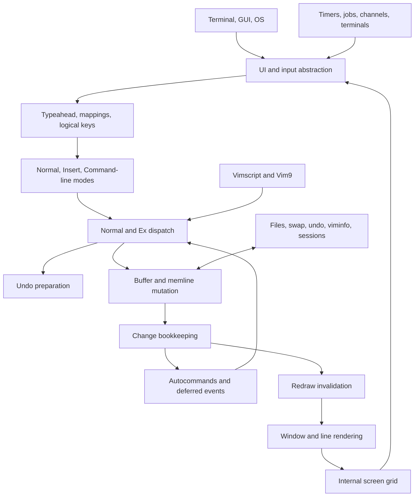
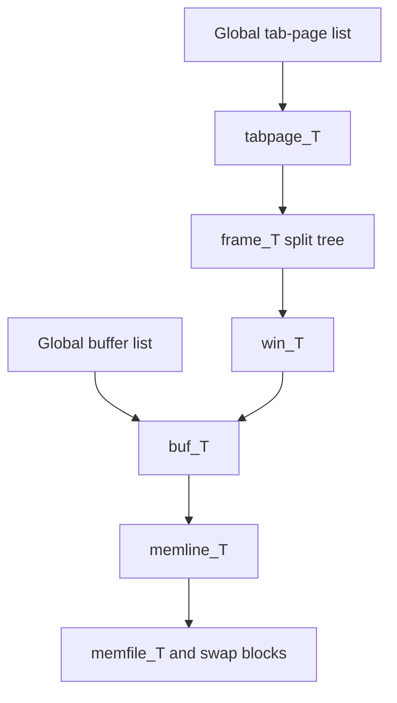

# Vim Architecture and Component Map

## Scope

This is the Vim architectural reference in the documentation path defined by [`UPGRADE.md`](UPGRADE.md). NxVim implementation status belongs in [`../RESET.md`](../RESET.md), and preserved Rust infrastructure boundaries belong in [`CONTRACTS.md`](CONTRACTS.md).

This document describes how Vim's core is organized, which components own each responsibility, and how those components cooperate at runtime. It is based on the Vim 9.2 source checkout at `reference/vim/src` (commit `da1fecc6`).

Vim is a mature, mostly single-threaded C program. It does not enforce strict module boundaries: most source files include the shared `vim.h` umbrella header and operate on process-wide state such as `curbuf`, `curwin`, and `State`. Nevertheless, the code forms recognizable subsystems connected through a small number of central types and APIs.

## Architecture at a Glance



The central runtime pattern is:

> Read one logical command, execute it synchronously, record its consequences, then reconcile deferred events and the display at a safe event-loop boundary.

A typical edit therefore does **not** write directly to the terminal. It changes a buffer, updates undo/change metadata, marks windows dirty, and lets a later redraw render the result.

## Core State and Ownership

The important shared declarations are concentrated in:

- `reference/vim/src/vim.h` — umbrella header, common constants, modes, events, and feature declarations.
- `reference/vim/src/structs.h` — shared structures.
- `reference/vim/src/globals.h` — process-wide mutable state.
- `reference/vim/src/proto.h` and `reference/vim/src/proto/*.pro` — subsystem function prototypes.
- `reference/vim/src/feature.h` and generated `config.h` — compile-time feature selection.

### Fundamental objects

| Type/state | Role | Important relationships |
|---|---|---|
| `buf_T` | An open document and its editor metadata | Owns `b_ml` text storage, names, options, marks, undo history, variables, syntax state, and modified state |
| `memline_T` | Line-oriented text store | Backed by `memfile_T`; supports swap and recovery |
| `memfile_T` | Cached block/page store | Manages memory blocks and optional swap-file blocks |
| `win_T` | A view onto a buffer | References `w_buffer`; owns cursor, viewport, folds, matches, dimensions, and redraw caches |
| `tabpage_T` | A tab and its windows | Owns a `frame_T` split-layout tree and tab-local state |
| `frame_T` | Split-layout tree node | Row/column nodes compose child frames; leaves correspond to windows |
| `pos_T` | A position in a buffer | Used by cursors, marks, motions, operators, and selections |
| `oparg_T` | Pending Normal-mode operation | Carries operator, register, motion type, range, and Visual/block flags |
| `cmdarg_T` | Parsed Normal command | Carries keys, counts, flags, and an `oparg_T` |
| `exarg_T` | Parsed Ex command | Carries command index, range, modifiers, arguments, and force flag |
| `typval_T` | Runtime script value | Represents numbers, strings, lists, dictionaries, functions, jobs, objects, and other Vim values |

### Object graph



A buffer is independent of its views: it may be hidden, displayed once, or displayed by several windows. Windows belong to a tab's split tree, but buffers live in a separate global list.

The current context is exposed through globals:

- `curbuf` — active buffer.
- `curwin` — active window; normally `curwin->w_buffer == curbuf`.
- `curtab` — active tab page.
- `State` — current mode bits.
- `typebuf` — pending logical input and mapping results.
- `must_redraw` — accumulated redraw severity.

This design makes command handlers compact, but creates strong implicit coupling. Calls that trigger autocommands can switch or unload buffers and windows, so code must not assume that `curbuf`, `curwin`, or borrowed line pointers survive such calls.

## Startup and Main Loop

### Startup

The process entry and orchestration live in `reference/vim/src/main.c`.

```text
main()
  -> mch_early_init()
  -> autocmd_init()
  -> common_init_1()
  -> common_init_2()
       -> win_alloc_first()       creates initial tab/window/buffer
       -> set_init_1()            early option defaults
  -> parse command line
  -> initialize terminal/UI and screen dimensions
  -> source startup scripts
  -> vim_main2()
       -> load plugins/packages
       -> set_init_3()
       -> create_windows()
       -> open initial buffers
       -> run startup Ex commands
       -> BufEnter and VimEnter events
  -> main_loop()
```

Initialization is staged because some defaults require locale information, some require an existing buffer/window, and others depend on terminal dimensions or values set by the user's vimrc.

Startup scripts and plugins are not handled by a separate language path. Sourced lines ultimately enter the same Ex executor used by typed `:` commands.

### Main loop

`main.c:main_loop()` is the runtime coordinator. Each iteration broadly does the following:

1. Process deferred work, file-change checks, callbacks, synchronization, and pending events.
2. Compare cursor and changed-tick snapshots to trigger events such as `CursorMoved` and `TextChanged`.
3. Validate cursor/topline and redraw dirty screen regions.
4. Dispatch one Ex-mode or Normal-mode command.
5. Repeat.

Insert mode is generally a synchronous nested loop entered by a Normal command. Command-line mode similarly collects a line and sends it to the Ex executor before returning.

## Input, Mappings, and Modes

### Input pipeline

| Component | Responsibility |
|---|---|
| `os_unix.c`, `os_win32.c`, other `os_*.c` | Platform-specific waiting and byte input |
| `gui.c` and `gui_*.c` | GUI event and input backends |
| `ui.c` | Common UI boundary, including `ui_inchar()` and output routing |
| `term.c`, `termlib.c`, `kitty.c` | Terminal capabilities, escape sequences, and terminal key protocols |
| `getchar.c` | Typeahead, stuffed/scripted input, mapping expansion, recording, and logical keys |
| `map.c` | Mapping and abbreviation definitions and lookup |
| `mouse.c`, `digraph.c` | Mouse and digraph input |

`getchar.c:vgetc()` is the main logical-key API. It merges physical input with mapping results, script input, `:normal` input, recorded input, and other synthetic sources. Special keys and modifiers are decoded before mode dispatch receives them.

### Normal mode

`reference/vim/src/normal.c:normal_cmd()`:

1. Reads a logical key through `safe_vgetc()`.
2. Parses counts, registers, prefixes, and additional characters.
3. Finds an entry in the `nv_cmds[]` command table declared from `nv_cmds.h`.
4. Calls the selected `nv_*` handler.
5. Completes a pending operator when its motion has supplied a range.

`oparg_T` persists pending operator state across commands. For example, `d` establishes an operator and the following motion determines its range. Operator implementations are primarily in `ops.c`; registers and put/yank behavior are in `register.c`.

### Insert and Replace modes

`reference/vim/src/edit.c:edit()` owns the Insert/Replace mode loop. It:

- Fires mode-entry events.
- Sets `State` to Insert, Replace, or Virtual Replace.
- Reads keys through the same logical input pipeline.
- Dispatches editing, completion, movement, paste, and special keys.
- Calls shared change primitives for text mutations.
- Finalizes redo/undo state and mode-exit events before returning.

Related components include:

- `change.c` — shared character/line insertion and deletion primitives.
- `insexpand.c` — insert completion.
- `indent.c` and `cindent.c` — indentation.
- `move.c` — cursor movement.
- `search.c` — searching and search motions.
- `regexp.c`, `regexp_bt.c`, `regexp_nfa.c` — regex front end and engines.

### Command-line and Ex modes

- `ex_getln.c` edits `:`, `/`, and `?` command lines.
- `cmdexpand.c` performs command-line completion.
- `cmdhist.c` owns command, search, and input history.
- `ex_docmd.c:do_cmdline()` executes one or more Ex commands.
- `ex_docmd.c:do_one_cmd()` parses modifiers, ranges, command names, force flags, registers, and arguments into `exarg_T`.
- `ex_cmds.h` declares the built-in `cmdnames[]` command table.
- `ex_cmds.c`, `ex_cmds2.c`, and specialized files implement `ex_*` handlers.
- `usercmd.c` implements user-defined Ex commands.

`do_cmdline()` accepts either a command string or a callback that supplies lines. This makes it reusable by command-line mode, sourced scripts, functions, autocommands, and generated commands. It is intentionally recursive.

## Text Storage and Editing

### Memline and memfile

Vim does not store a buffer as one contiguous string. `reference/vim/src/memline.c` provides a line-oriented tree with these central APIs:

- `ml_get()` — retrieve a line.
- `ml_replace()` — replace a line.
- `ml_append()` — append a line after another line.
- `ml_delete()` — remove a line.

`reference/vim/src/memfile.c` manages the cached blocks behind memline and their optional swap-file representation. Together they support efficient line access, large files, dirty-block tracking, swap synchronization, and crash recovery.

The low-level `ml_*` functions only change text storage. Their callers must also update editor semantics through `changed_bytes()`, `changed_lines()`, `appended_lines()`, or `deleted_lines()`.

### Mutation contract

```text
Command semantics
  -> save undo state
  -> mutate with ml_replace/ml_append/ml_delete
  -> call changed_* notification
  -> update changed tick, marks, folds, caches, and dirty ranges
  -> schedule redraw
```

`undo.c` manages an undo tree rather than only a linear stack. Functions such as `u_save()` preserve affected text before a mutation; buffer-local undo headers represent branches and support persistent undo.

A representative character insertion is:

```text
edit.c:edit()
  -> change.c:ins_char()
  -> change.c:ins_char_bytes()
  -> memline.c:ml_replace()
  -> change.c:changed_bytes()
  -> change.c:changed_common()
```

`changed_common()` marks the buffer modified, increments its changed tick, updates affected window/cache state, records the smallest dirty line range, and raises `must_redraw`.

## Buffers, Files, Windows, and Tabs

### Buffers and files

| File | Responsibility |
|---|---|
| `buffer.c` | Buffer creation, lookup, switching, loading, unloading, and deletion; includes `buflist_new()` and `open_buffer()` |
| `fileio.c` | File reads, encoding and line-ending conversion, metadata, and read events |
| `bufwrite.c` | Writes, backups, renames, filters, and write events |
| `filepath.c`, `findfile.c` | Path manipulation and file search |
| `arglist.c` | Global/window argument lists and `:next` traversal |
| `mark.c` | Marks, jumplists, changelists, and file marks |
| `undo.c` | Buffer-local undo tree and persistent undo files |

File I/O surrounds significant phases with autocommands. Those callbacks may alter the active buffer or abort an operation, which explains many validity and locking checks in these paths.

### Windows and tabs

`window.c` manages window allocation, entering/leaving, split creation, frame-tree changes, resizing, and tab switching. The separation is important:

- A **buffer** owns editable content.
- A **window** owns a cursor and a presentation of a buffer.
- A **tab page** owns one split layout of windows.
- A **frame tree** determines how those windows divide available rows and columns.

Supporting view systems include:

- `fold.c` — fold definitions and folded-line calculations.
- `diff.c`, `linematch.c`, `xdiff/` — diff comparison and tab-oriented diff state.
- `popupwin.c` — popup windows outside the normal split tree.
- `quickfix.c` — quickfix and location lists.
- `sign.c` and `textprop.c` — signs and text properties.

## Rendering and UI

Vim keeps an internal representation of the terminal/GUI grid and redraws invalid regions rather than repainting everything after every command.

```text
changed_*()
  -> dirty buffer/window ranges + must_redraw
  -> main_loop()
  -> drawscreen.c:update_screen()
  -> drawscreen.c:win_update() for dirty windows
  -> drawline.c:win_line() composes logical lines into screen rows
  -> screen.c screen-grid operations
  -> ui.c
  -> terminal or GUI backend
```

### Rendering components

| Component | Responsibility |
|---|---|
| `drawscreen.c` | Coordinates redraw scope; `update_screen()`, `win_update()`, and redraw scheduling |
| `drawline.c` | Composes buffer text, wrapping, folds, syntax, spell, selections, signs, concealment, properties, and virtual text into rows |
| `screen.c` | Manipulates and commits the internal screen grid |
| `highlight.c`, `syntax.c`, `match.c` | Highlight groups, syntax state, and matches |
| `message.c` | Messages, prompts, pagination, and command-line display |
| `popupmenu.c` | Completion popup menu |
| `spell.c`, `spellfile.c`, `spellsuggest.c` | Spell checking and suggestions |

The buffer's `b_mod_*` fields summarize changed lines. A window's redraw type and cached displayed-line information let `win_update()` decide which old rows can be reused, scrolled, or regenerated.

### Backends

`ui.c` is the core/backend boundary. Terminal behavior is implemented through `term.c` plus OS-specific code. GUI-neutral behavior lives in `gui.c`, with backends such as GTK, GTK4, X11, Windows, Haiku, Motif, and Photon in `gui_*.c`. Clipboard support is separated into `clipboard.c` and platform-specific helpers such as `winclip.c`.

## Scripting

Vim's script systems share editor commands, values, containers, variables, events, and built-in functions.

### Legacy Vimscript

| Component | Responsibility |
|---|---|
| `typval.c` | `typval_T` lifecycle, conversion, copying, and comparison |
| `list.c`, `dict.c`, `blob.c` | Core script containers |
| `hashtab.c`, `gc.c` | Hash tables and garbage collection |
| `eval.c` | Expression parser and evaluator |
| `evalfunc.c` | Built-in functions |
| `evalvars.c` | Variables and `g:`, `b:`, `w:`, `t:`, `s:`, `l:`, and `v:` scopes |
| `userfunc.c` | User functions, closures, and call frames |
| `scriptfile.c` | Script sourcing, script IDs, imports, and script context |
| `debugger.c`, `profiler.c` | Script debugging and profiling |

### Vim9

- `vim9compile.c` compiles `:def` functions.
- `vim9execute.c` and `vim9instr.c` execute compiled instructions.
- `vim9expr.c` and `vim9cmds.c` handle Vim9 expressions and commands.
- `vim9type.c` and `vim9generics.c` implement types and generics.
- `vim9script.c` and `vim9class.c` implement modules and object-oriented features.

The compiled and interpreted paths converge on shared `typval_T` values, editor APIs, Ex commands, variables, exceptions, and events.

## Autocommands and Deferred Events

`reference/vim/src/autocmd.c` stores ordered event-pattern entries and their command lists. The public trigger is `apply_autocmds()`; internal matching and execution happen in `apply_autocmds_group()`.

Autocommand bodies reuse the Ex engine:

```text
subsystem calls apply_autocmds(event, ...)
  -> match event patterns and groups
  -> do_cmdline(getnextac, ...)
  -> do_one_cmd()
  -> built-in or user Ex handler
```

This is a major integration point: an event callback can execute any Ex command, source scripts, switch windows, modify buffers, or trigger nested events. Recursion depth, `nested` flags, active-pattern state, and object locks guard this re-entrant behavior.

Some events fire directly around operations, such as `BufRead`, `BufWrite`, `InsertEnter`, and `InsertLeave`. Others are deferred until a safe loop boundary. For example, text mutations increment a buffer changed tick; the main loop compares it with the last observed tick and then triggers `TextChanged`.

## Asynchronous and External Integration

Vim's editor state remains coordinated by the main loop. Jobs and channels can perform external work, but callbacks are serviced at event/input boundaries rather than freely mutating editor state from worker threads.

| Component | Responsibility |
|---|---|
| `time.c` | Timers and time-based callback scheduling |
| `job.c` | Child-process lifecycle |
| `channel.c` | Socket/pipe communication, buffering, and callbacks |
| `json.c` | JSON encoding and streaming decode for channels |
| `terminal.c`, `libvterm/` | Terminal buffers and terminal emulation |
| `clientserver.c`, `socketserver.c`, `if_xcmdsrv.c` | Remote client/server control |
| `netbeans.c` | NetBeans external-editor protocol |
| `if_cscope.c` | Cscope integration |
| `if_python*.c`, `if_lua.c`, `if_ruby.c`, `if_tcl.c`, others | Embedded language interfaces |

`main_loop()` and the input-waiting code provide the cooperation point among user input, timers, jobs, channels, GUI events, terminal activity, and redraw.

## Persistence

Vim's persistence is split by concern:

- `memline.c` and `memfile.c` — swap files and crash recovery.
- `undo.c` — in-memory undo tree and persistent undo files.
- `viminfo.c` — histories, registers, marks, jumps, and related cross-session state.
- `session.c` — sessions and views, serialized primarily as executable Ex commands.
- `cmdhist.c`, `mark.c`, and `register.c` — own state later serialized by viminfo.

This mirrors the runtime architecture: buffer text recovery, edit history, general editor history, and layout restoration have different lifetimes and formats.

## End-to-End Flows

### Typing `iX<Esc>`

```mermaid
sequenceDiagram
    participant Loop as main_loop
    participant Normal as normal_cmd
    participant Insert as edit
    participant Change as change.c
    participant Text as memline.c
    participant Events as autocmd.c
    participant Draw as drawscreen.c

    Loop->>Normal: dispatch i
    Normal->>Insert: edit(...)
    Insert->>Events: InsertEnter
    Insert->>Insert: read X through vgetc
    Insert->>Events: InsertCharPre
    Insert->>Change: ins_char(X)
    Change->>Text: ml_replace(...)
    Change->>Change: changed_bytes / changed_common
    Note over Change: modified + changedtick + dirty ranges
    Insert->>Events: InsertLeavePre / InsertLeave
    Insert-->>Normal: return on Esc
    Normal-->>Loop: command complete
    Loop->>Events: deferred TextChanged
    Loop->>Draw: update_screen()
```

### Executing `:delete`

```text
main_loop()
  -> normal_cmd()
  -> nv_colon()
  -> ex_getln.c collects "delete"
  -> do_cmdline()
  -> do_one_cmd()
       -> parse range and arguments into exarg_T
       -> find handler in cmdnames[]
       -> execute delete handler/operator
       -> save undo
       -> ml_delete()/ml_replace()
       -> deleted_lines()/changed_lines()
       -> changed_common()
  -> return to main_loop()
  -> deferred events and redraw
```

### Reading a file into a buffer

```text
Ex/startup/window action
  -> buffer.c creates or selects buf_T
  -> open_buffer()
  -> fileio.c:readfile()
       -> pre-read autocommands
       -> decode bytes and line endings
       -> populate memline
       -> update metadata and options
       -> post-read autocommands
  -> window references buffer
  -> redraw scheduled
```

## Central Coupling Points

| Concern | Central API/state |
|---|---|
| Active context | `curbuf`, `curwin`, `curtab` |
| Editor mode | `State`, Visual and pending-operator globals |
| Input | `typebuf`, `vgetc()`, `safe_vgetc()` |
| Normal dispatch | `normal_cmd()`, `nv_cmds[]`, `cmdarg_T`, `oparg_T` |
| Ex dispatch | `do_cmdline()`, `do_one_cmd()`, `cmdnames[]`, `exarg_T` |
| Text storage | `ml_get()`, `ml_replace()`, `ml_append()`, `ml_delete()` |
| Undo | `u_save()` and buffer-local undo headers |
| Change propagation | `changed_bytes()`, `changed_lines()`, `changed_common()` |
| Event execution | `apply_autocmds()`, recursively using `do_cmdline()` |
| Display invalidation | buffer `b_mod_*`, window redraw state, `must_redraw` |
| Rendering | `update_screen()`, `win_update()`, `win_line()` |
| Script values | `typval_T`, variable scopes, containers, GC |
| External events | UI wait loop, timers, jobs, channels, terminal buffers |

## Architectural Lessons

1. **Buffer and view are separate.** `buf_T` owns document state; `win_T` owns cursor and presentation state; tabs own split layouts.
2. **Commands converge on shared mutation primitives.** Normal commands, Ex commands, scripts, and autocommands eventually use the same buffer, undo, and change APIs.
3. **Mutation and rendering are decoupled.** Changes accumulate invalidation; the main loop batches rendering work.
4. **Ex is Vim's integration language.** Startup scripts, user commands, autocommands, sessions, and many generated actions all feed `do_cmdline()`.
5. **The event model is re-entrant.** Autocommands can recursively run arbitrary editor operations, so object lifetime and current-context assumptions require care.
6. **Global state is the practical core.** Vim's subsystems are conceptually distinct but communicate heavily through shared globals and structures rather than explicit service interfaces.
7. **Feature flags shape the binary.** GUI systems, interpreters, jobs, terminals, and many advanced features are conditionally compiled through `feature.h` and generated configuration.

For a Vim-like editor implementation, the most reusable decomposition is the ownership and flow model—not Vim's global-state coupling: keep buffers independent from windows, centralize command dispatch and mutation bookkeeping, make events explicit, and batch redraw from recorded invalidation.
